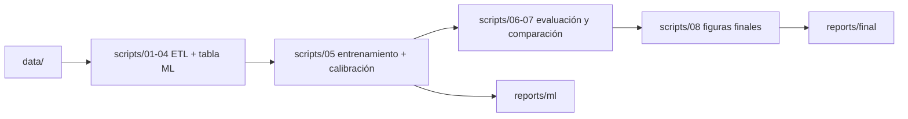
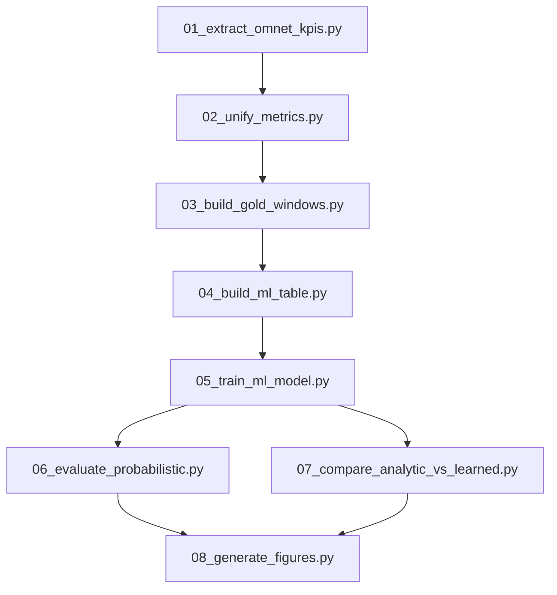
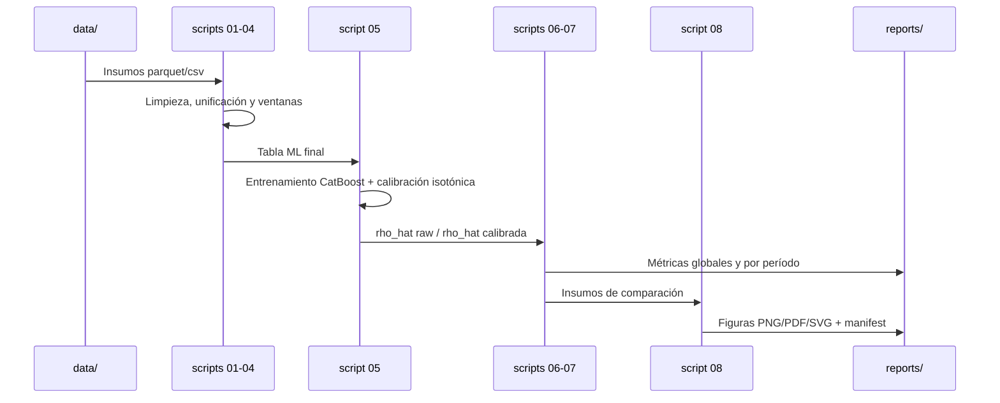

# InTAS_PRODUCCION_READY

Repositorio de ejecución reproducible para el pipeline **InTAS + ML**.

Este documento describe, con detalle técnico y operativo, cómo funciona el paquete, qué se logra con cada módulo, cómo ejecutarlo localmente y con Docker, cómo validar resultados, y cuáles son los límites actuales del alcance.

---

## Tabla de contenidos

1. [Contexto del proyecto](#contexto-del-proyecto)
2. [Objetivo técnico del pipeline](#objetivo-técnico-del-pipeline)
3. [Qué se logra al ejecutarlo](#qué-se-logra-al-ejecutarlo)
4. [Arquitectura general](#arquitectura-general)
5. [Arquitectura funcional por módulos](#arquitectura-funcional-por-módulos)
6. [Flujo de datos end-to-end](#flujo-de-datos-end-to-end)
7. [Estructura de carpetas](#estructura-de-carpetas)
8. [Requisitos de sistema](#requisitos-de-sistema)
9. [Ejecución local paso a paso](#ejecución-local-paso-a-paso)
10. [Ejecución con Docker paso a paso](#ejecución-con-docker-paso-a-paso)
11. [Descripción detallada de cada script](#descripción-detallada-de-cada-script)
12. [Entradas y salidas por etapa](#entradas-y-salidas-por-etapa)
13. [Cómo validar que corrió correctamente](#cómo-validar-que-corrió-correctamente)
14. [Reproducibilidad y trazabilidad](#reproducibilidad-y-trazabilidad)
15. [Resolución de problemas comunes](#resolución-de-problemas-comunes)
16. [Limitaciones actuales y alcance real](#limitaciones-actuales-y-alcance-real)
17. [Ruta para pipeline 100% desde simulación](#ruta-para-pipeline-100-desde-simulación)
18. [Comandos útiles](#comandos-útiles)
19. [FAQ técnica](#faq-técnica)
20. [Documentación relacionada](#documentación-relacionada)

---

## Contexto del proyecto

El ecosistema InTAS modela un sistema CPSS (Cyber-Physical-Social System) donde:

- La capa física se observa a través de movilidad vehicular (SUMO).
- La capa ciber se modela con red celular (OMNeT++/Simu5G/INET/Artery en la visión completa).
- La capa social se aproxima mediante incertidumbre de comportamiento de los conductores.

En esta carpeta (`InTAS_PRODUCCION_READY`) se entrega un pipeline orientado a reproducibilidad de resultados de analítica y ML, con artefactos de datos ya organizados.

---

## Objetivo técnico del pipeline

Transformar artefactos de datos de movilidad/red en un resultado probabilístico calibrado:

- Estimar `rho_hat` (probabilidad aprendida de desvío de ruta).
- Calibrar `rho_hat` para mejorar consistencia probabilística operativa.
- Comparar `rho_hat` con una referencia analítica (`rho`).
- Generar métricas y figuras finales para análisis/reporte.

---

## Qué se logra al ejecutarlo

Al ejecutar correctamente el pipeline se obtiene:

1. Modelo CatBoost entrenado.
2. Calibrador isotónico persistido.
3. Predicciones `rho_hat` en versión raw y calibrada.
4. Métricas de validez probabilística (Brier/ECE soft).
5. Métricas de comparación analítica vs aprendida (MAE/RMSE/correlación).
6. Figuras finales en PNG/PDF/SVG.
7. Manifiesto de figuras y reportes para trazabilidad.

---

## Arquitectura general



La arquitectura está separada por responsabilidades:

- **Datos** (`data/`)
- **Procesamiento y modelado** (`scripts/`)
- **Evidencia analítica** (`reports/`)

---

## Arquitectura funcional por módulos



Interpretación funcional:

- M1-M2: red y consolidación.
- M3-M4: dataset supervisado.
- M5: modelo + calibración.
- M6-M7: calidad probabilística y ajuste vs referencia.
- M8: visualización final.

---

## Flujo de datos end-to-end



---

## Estructura de carpetas

Estructura funcional principal:

```text
InTAS_PRODUCCION_READY/
├── README.md
├── README_DOCKER.md
├── Dockerfile
├── requirements.txt
├── config/
│   └── ml/
├── scenarios/
│   ├── sumo/
│   └── omnet/
├── scripts/
│   ├── run_full_reproduction.py
│   ├── 01_extract_omnet_kpis.py
│   ├── 02_unify_metrics.py
│   ├── 03_build_gold_windows.py
│   ├── 04_build_ml_table.py
│   ├── 05_train_ml_model.py
│   ├── 06_evaluate_probabilistic.py
│   ├── 07_compare_analytic_vs_learned.py
│   ├── 08_generate_figures.py
│   └── helpers/
├── data/
│   ├── bronze/
│   ├── silver/
│   ├── gold/
│   ├── models/
│   ├── theory/
│   └── artifacts/
└── reports/
    ├── ml/
    └── final/
```

---

## Requisitos de sistema

### Requisitos mínimos para ejecución local

- Sistema operativo Linux, WSL2 o macOS.
- Python 3.10+ (recomendado 3.11/3.12).
- Espacio en disco suficiente para artefactos de salida.
- RAM recomendada >= 16 GB para etapas de datos grandes.

### Requisitos para Docker

- Docker Engine instalado y funcionando.
- Permisos de usuario para build/run.
- Espacio en disco para capas de imagen y resultados.

### Dependencias Python

Se instalan desde `requirements.txt`.

Nota:

- Se utiliza `numpy==1.26.4` para compatibilidad de resolución de dependencias.

---

## Ejecución local paso a paso

### 1) Abrir terminal en la raíz del proyecto

```bash
cd /ruta/a/InTAS_PRODUCCION_READY
```

### 2) Crear entorno virtual

```bash
python3 -m venv .venv
```

### 3) Activar entorno virtual

```bash
. .venv/bin/activate
```

### 4) Instalar dependencias

```bash
pip install -r requirements.txt
```

### 5) Ejecutar orquestador

```bash
python scripts/run_full_reproduction.py
```

### 6) Verificar outputs

```bash
ls -la reports/final
ls -la reports/final/thesis_figures
```

---

## Ejecución con Docker paso a paso

Esta modalidad permite ejecutar el flujo sin instalar librerías Python directamente en el host.

### 1) Construir imagen

```bash
docker build -t intas-tesis .
```

Qué logra este paso:

- Construye entorno Ubuntu con dependencias de Python y utilidades requeridas.
- Copia el repositorio al contenedor.
- Define `scripts/run_full_reproduction.py` como comando de arranque.

### 2) Ejecutar pipeline en contenedor

```bash
docker run --name intas-container intas-tesis
```

Qué logra este paso:

- Lanza ejecución del pipeline completo dentro de `/app`.
- Genera reportes y figuras dentro del filesystem del contenedor.

### 3) Copiar resultados al host

```bash
docker cp intas-container:/app/reports/final ./resultados_tesis
```

Qué logra este paso:

- Extrae resultados finales para revisión externa.

### 4) Limpieza opcional del contenedor

```bash
docker rm intas-container
```

---

## Descripción detallada de cada script

### `scripts/run_full_reproduction.py`

Responsabilidad:

- Orquestar las 8 etapas.
- Ejecutar en modo incremental por defecto.
- Permitir reconstrucción total con `INTAS_FORCE_REBUILD=1`.

Qué significa modo incremental:

- Si la salida esperada de una etapa ya existe, el paso se omite.
- Reduce tiempos de re-ejecución en pruebas repetidas.

### `scripts/01_extract_omnet_kpis.py`

Responsabilidad:

- Extraer KPIs de archivos `.sca` cuando existen.
- Generar inventario y reportes de cobertura KPI.

Resultado típico:

- `reports/final/objetivo2/kpis_omnet_raw.csv`
- `reports/final/objetivo2/kpis_omnet_by_cell.csv`
- `reports/final/objetivo2/kpis_omnet_inventory_report.txt`

### `scripts/02_unify_metrics.py`

Responsabilidad:

- Unificar métricas de movilidad y red en tabla consolidada.

Comportamiento importante:

- Si faltan insumos de unificación pero existe `data/unified_metrics.parquet`, reutiliza ese artefacto.

### `scripts/03_build_gold_windows.py`

Responsabilidad:

- Construir ventanas temporales y features por muestra.
- Integrar contexto de celda/exposición de red en dataset Gold.

Salida:

- `data/dataset_windows.parquet`

### `scripts/04_build_ml_table.py`

Responsabilidad:

- Seleccionar/normalizar columnas finales para entrenamiento.

Salida:

- `data/ml_table.parquet`

### `scripts/05_train_ml_model.py`

Responsabilidad:

- Entrenar CatBoost.
- Calibrar probabilidades con isotonic regression.
- Persistir modelo, calibrador y predicciones raw/calibradas.

Salidas clave:

- `data/models/catboost_gbdt.cbm`
- `data/models/isotonic.joblib`
- `data/artifacts/ml/final/rho_hat_windows_raw.parquet`
- `data/artifacts/ml/final/rho_hat_windows_calibrated.parquet`
- `reports/ml/report_catboost_isotonic.json`
- `reports/ml/ablation_auc.csv`

### `scripts/06_evaluate_probabilistic.py`

Responsabilidad:

- Calcular validez probabilística global por variante (`Brier`, `ECE` soft).
- Exportar curvas y reportes.

Salida:

- `reports/final/probabilistic_validity_global.csv`

### `scripts/07_compare_analytic_vs_learned.py`

Responsabilidad:

- Comparar `rho` analítica con variantes de `rho_hat`.
- Calcular MAE/RMSE/bias/corr.

Salida:

- `reports/final/rho_compare_recomputed_global.csv`

### `scripts/08_generate_figures.py`

Responsabilidad:

- Generar figuras finales desde outputs reales del pipeline.
- Guardar PNG/PDF/SVG + manifest.

Salida:

- `reports/final/thesis_figures/`
- `reports/final/thesis_figures/figures_manifest.md`

---

## Entradas y salidas por etapa

| Etapa | Entrada principal | Salida principal | Objetivo operativo |
|---|---|---|---|
| 01 | `.sca` OMNeT (si existen) | KPIs raw/by-cell | extraer señal de red |
| 02 | movilidad + KPI summary | `data/unified_metrics.parquet` | consolidar vista movilidad/red |
| 03 | route labels/events + FCD + exposure | `data/dataset_windows.parquet` | construir dataset Gold |
| 04 | dataset Gold | `data/ml_table.parquet` | dejar tabla entrenable |
| 05 | tabla ML | modelos + `rho_hat` raw/cal | aprender y calibrar probabilidad |
| 06 | referencia analítica + `rho_hat` | `probabilistic_validity_global.csv` | medir calidad probabilística |
| 07 | referencia analítica + `rho_hat` | `rho_compare_recomputed_global.csv` | medir alineación predictiva |
| 08 | outputs 05-07 | figuras y manifest | producir evidencia visual final |

---

## Cómo validar que corrió correctamente

Checklist mínimo:

1. Existe reporte de entrenamiento:

```bash
test -f reports/ml/report_catboost_isotonic.json && echo OK
```

2. Existen probabilidades raw/calibradas:

```bash
test -f data/artifacts/ml/final/rho_hat_windows_raw.parquet && echo OK
test -f data/artifacts/ml/final/rho_hat_windows_calibrated.parquet && echo OK
```

3. Existen métricas comparativas:

```bash
test -f reports/final/rho_compare_recomputed_global.csv && echo OK
test -f reports/final/probabilistic_validity_global.csv && echo OK
```

4. Existen figuras:

```bash
test -f reports/final/thesis_figures/figures_manifest.md && echo OK
```

5. Inspección rápida de métricas:

```bash
python - <<'PY'
import pandas as pd
print(pd.read_csv("reports/final/rho_compare_recomputed_global.csv").head())
print(pd.read_csv("reports/final/probabilistic_validity_global.csv").head())
PY
```

---

## Reproducibilidad y trazabilidad

Mecanismos actuales:

- Semillas fijas de entrenamiento (`seed` en script 05).
- Persistencia de artefactos intermedios y finales.
- Reportes explícitos en `reports/ml` y `reports/final`.
- Modo incremental para iteración controlada.
- Modo `INTAS_FORCE_REBUILD=1` para reconstrucción completa de etapas.

Qué permite esto:

- Repetir corrida en la misma carpeta con resultados consistentes.
- Auditar qué se usó y qué se generó.
- Comparar corridas entre versiones de datos/modelo.

---

## Resolución de problemas comunes

### Error: entorno Python administrado (PEP 668)

Síntoma:

- `error: externally-managed-environment`

Solución:

- Usar entorno virtual local:

```bash
python3 -m venv .venv
. .venv/bin/activate
pip install -r requirements.txt
```

### Error: dependencia conflictiva de NumPy/Pandas

Síntoma:

- `ResolutionImpossible` al instalar.

Solución:

- Usar `requirements.txt` actual del repo (incluye versión compatible).

### Error: no se encuentran `.sca` de OMNeT

Síntoma:

- Paso 01 reporta inventario vacío.

Interpretación:

- No hay resultados crudos de OMNeT dentro de rutas esperadas.

Impacto:

- El pipeline puede continuar si existen artefactos precomputados de datos.

### Warnings de fuente `Times New Roman` en figuras

Síntoma:

- `findfont: Font family 'Times New Roman' not found.`

Impacto:

- No bloquea ejecución; las figuras se generan con fuente fallback.

Opcional:

- Instalar la fuente si se requiere estilo tipográfico exacto.

---

## Limitaciones actuales y alcance real

Alcance que sí está cubierto por esta carpeta:

- Pipeline de datos+ML+calibración+comparación+figuras.
- Reproducción operativa de artefactos finales en `reports/`.

Alcance no cubierto al 100% todavía:

- Re-simulación OMNeT++ completa desde cero dentro del mismo flujo automatizado, incluyendo compilación y ejecución del stack completo (OMNeT/INET/Simu5G/Artery) como parte integrada.

---

## Ruta para pipeline 100% desde simulación

Para pasar de estado actual a estado full end-to-end desde simulación:

1. Versionar dependencias de simulación con commits fijos.
2. Añadir Docker/CI que compile stack OMNeT/INET/Simu5G/Artery.
3. Implementar runner batch de corridas (escenarios × políticas × réplicas).
4. Integrar extracción automática `.sca/.vec/.xml` hacia `data/`.
5. Encadenar runner de simulación con etapas 01-08 en un único comando reproducible.
6. Validar equivalencia de resultados con reportes de referencia.

---

## Comandos útiles

### Ejecutar pipeline incremental

```bash
python scripts/run_full_reproduction.py
```

### Forzar reconstrucción de todas las etapas

```bash
INTAS_FORCE_REBUILD=1 python scripts/run_full_reproduction.py
```

### Ejecutar solo entrenamiento/calibración

```bash
python scripts/05_train_ml_model.py
```

### Ejecutar solo evaluación y comparación

```bash
python scripts/06_evaluate_probabilistic.py
python scripts/07_compare_analytic_vs_learned.py
```

### Regenerar solo figuras

```bash
python scripts/08_generate_figures.py
```

### Ejecutar con Docker

```bash
docker build -t intas-tesis .
docker run --name intas-container intas-tesis
docker cp intas-container:/app/reports/final ./resultados_tesis
```

---

## FAQ técnica

### ¿El pipeline corre completo con un solo comando?

Sí, con:

```bash
python scripts/run_full_reproduction.py
```

### ¿Siempre recalcula todo?

No. Por defecto usa modo incremental.

### ¿Cómo se fuerza recalcular todo?

Con:

```bash
INTAS_FORCE_REBUILD=1 python scripts/run_full_reproduction.py
```

### ¿Qué archivo resume métricas del entrenamiento?

`reports/ml/report_catboost_isotonic.json`.

### ¿Qué archivo resume comparación analítica vs aprendida?

`reports/final/rho_compare_recomputed_global.csv`.

### ¿Dónde están las figuras finales?

`reports/final/thesis_figures/`.

### ¿Docker elimina la necesidad de Python local?

Sí para la ejecución del pipeline dentro del contenedor.

### ¿Este paquete ya compila y ejecuta OMNeT completo automáticamente?

No todavía como flujo full integrado; ese es el siguiente escalón de integración.

---

## Documentación relacionada

- `README_DOCKER.md`: guía específica de contenedor.
- `docs/GUIDE.md`: guía operativa resumida.
- `docs/MANUAL_DISEÑO_INGENIERIA.md`: manual técnico de arquitectura.
- `docs/THESIS_INTEGRATION.md`: texto y alineación de integración para reporte académico.

---

## Resumen ejecutivo

Este repositorio entrega un pipeline reproducible y auditable para:

- generar `rho_hat`,
- calibrar probabilidades,
- comparar con referencia analítica,
- y producir evidencia cuantitativa/visual final.

La parte de simulación OMNeT full desde cero está definida como siguiente fase de integración, pero el flujo analítico principal está operativo y documentado en detalle en este README.
