# InTAS: Sistema de Predicción de Desvío de Ruta en Redes 5G Vehiculares mediante Aprendizaje Automático Calibrado

## Documentación Técnica Integral — Arquitectura, Pipeline, Modelos y Reproducibilidad

**Proyecto:** InTAS — Ingolstadt Traffic and Automotive Simulation  
**Versión:** 1.0 (Tesis de Pregrado, 2026)  
**Plataforma:** SUMO v1.16+ · OMNeT++ v6.0 · INET 4.4 · Simu5G 1.3 · Python 3.10+  
**Autor:** Jose David Arias Pantoja  
**Universidad:** Universidad Cooperativa de Colombia  
**Director de Tesis:** Nestor Alzate Mejia  
**Estándar de documentación:** IEEE 1016-2009 / ISO/IEC 25010

---

## Tabla de Contenidos

1. [Introducción](#1-introducción)
2. [Objetivos](#2-objetivos)
3. [Marco Conceptual](#3-marco-conceptual)
4. [Arquitectura General del Sistema](#4-arquitectura-general-del-sistema)
5. [Arquitectura de Datos](#5-arquitectura-de-datos)
6. [Arquitectura del Pipeline de Procesamiento](#6-arquitectura-del-pipeline-de-procesamiento)
7. [Documentación de Scripts](#7-documentación-de-scripts)
8. [Flujo de Datos End-to-End](#8-flujo-de-datos-end-to-end)
9. [Modelo de Aprendizaje Automático](#9-modelo-de-aprendizaje-automático)
10. [Validación Experimental](#10-validación-experimental)
11. [Integración SUMO → OMNeT++](#11-integración-sumo--omnet)
12. [Reproducibilidad](#12-reproducibilidad)
13. [DevOps y MLOps](#13-devops-y-mlops)
14. [Seguridad y Gestión de Riesgos](#14-seguridad-y-gestión-de-riesgos)
15. [Limitaciones del Sistema](#15-limitaciones-del-sistema)
16. [Manual Técnico de Operación](#16-manual-técnico-de-operación)
17. [Manual de Usuario](#17-manual-de-usuario)
18. [Diagramas del Sistema](#18-diagramas-del-sistema)
19. [Buenas Prácticas Aplicadas](#19-buenas-prácticas-aplicadas)
20. [Glosario de Términos](#20-glosario-de-términos)
21. [Bibliografía y Referencias](#21-bibliografía-y-referencias)

---

## 1. Introducción

### 1.1 Contexto y Motivación

InTAS es un entorno de simulación co-diseñado para estudiar el comportamiento de vehículos conectados en redes 5G dentro de la ciudad de Ingolstadt, Alemania. El sistema aborda una pregunta de investigación central: **¿puede un modelo de aprendizaje automático (ML) estimar con precisión la probabilidad de que un vehículo se desvíe de su ruta planificada, y puede esa estimación mejorar proactivamente la conectividad 5G?**

El problema es relevante porque los vehículos conectados dependen de una conectividad continua de baja latencia. Los desvíos de ruta no planificados pueden causar pérdida de conexión (handover tardío), degradación de QoS (Quality of Service) y caídas de sesión. Si el sistema de red anticipa el comportamiento de desvío antes de que ocurra, puede activar conectividad dual (DoubleConnection) de manera proactiva, manteniendo la experiencia de usuario.

### 1.2 Alcance del Sistema

El sistema InTAS abarca tres capas integradas que conforman un Cyber-Physical-Social System (CPSS):

| Capa | Herramienta | Descripción |
|------|-------------|-------------|
| **Física** | SUMO v1.16+ | Simulación microscópica de tráfico vehicular (posición, velocidad, aceleración) |
| **Ciber** | OMNeT++ v6.0 + Simu5G 1.3 | Simulación de red 5G NR (SINR, PRB, CDR) con trazas SUMO reales |
| **Social** | ML (CatBoost + Calibración Isotónica) | Estimación de probabilidad de desvío de ruta (ρ̂) |

### 1.3 Escenario Geográfico

El mapa base es la red vial real de Ingolstadt, Alemania, representada en formato SUMO (`.net.xml`). Se definen **10 celdas 5G** sobre el área simulada, cada una cubriendo un segmento geográfico de la red vial. Los vehículos transitan por estas celdas y el sistema registra la exposición por celda (`cell_exposure`), que luego se usa para asociar métricas de red a cada vehículo.

### 1.4 Estructura del Repositorio

```
InTAS_PRODUCCION_READY_ligero/
├── scripts/               # 17 scripts del pipeline (00a → 08)
├── data/                  # Datos Bronze, Silver, Gold, ML, Modelos
│   ├── bronze/            # (generado con INTAS_RUN_SUMO=1)
│   ├── silver/            # Datos procesados (seeds incluidos)
│   ├── theory/            # Referencia analítica ρ
│   ├── models/            # Modelos entrenados (.cbm, .joblib, .json)
│   ├── artifacts/         # rho_hat raw/calibrado, plan inyección
│   ├── dataset_windows.parquet  # Gold seed (42 503 filas × 43 cols)
│   ├── ml_table.parquet         # Tabla ML refinada
│   └── unified_metrics.parquet  # Métricas unificadas SUMO+OMNeT++
├── scenarios/
│   ├── sumo/              # .sumocfg, rutas .rou.xml, red .net.xml
│   └── omnet/             # omnetpp.ini, configs de celdas
├── config/ml/             # experiment.yaml, pipeline.yaml, best_model_report.json
├── docs/                  # Documentación técnica
├── reports/               # Figuras G1-G7, CSVs de evaluación
├── Dockerfile             # Imagen reproducible Ubuntu 22.04
├── requirements.txt       # Dependencias Python fijadas
└── README.md              # Guía rápida de reproducción
```

---

## 2. Objetivos

### 2.1 Objetivo General

Diseñar, implementar y validar un sistema CPSS que integre simulación vehicular microscópica (SUMO), simulación de red 5G (OMNeT++/Simu5G) y aprendizaje automático calibrado para estimar la probabilidad de desvío de ruta vehicular y optimizar proactivamente la conectividad de red.

### 2.2 Objetivos Específicos

**Objetivo 1 — Caracterización de escenarios:**  
Definir un espacio de escenarios de simulación que combine períodos de congestión (HC1, HC2, HC3), densidades de tráfico (5%, 10%) y políticas de enrutamiento (`nearest`, `ceiling`) en 180 corridas reproducibles.

**Objetivo 2 — Estimación probabilística ρ̂:**  
Entrenar y calibrar un clasificador CatBoost + Isotonic Regression que aproxime la probabilidad analítica de desvío ρ mediante features cinemáticas y métricas de red 5G, con AUC ≥ 0.90 y ECE ≤ 0.01.

**Objetivo 3 — Validación cruzada:**  
Comparar ρ̂ contra la referencia analítica ρ usando métricas probabilísticas (Brier Score, ECE) y segmentación por perfiles comportamentales MMtQHU (propietario / empleado).

**Objetivo 4 — Reinyección y mejora de QoS:**  
Usar el plan de inyección derivado de ρ̂ para seleccionar configuraciones OMNeT++ por corrida (DoubleConnection vs. SingleConnection) y medir el impacto en KPIs de red.

**Objetivo 5 — Reproducibilidad completa:**  
Proveer un entorno Docker con seeds pre-generadas que permite reproducir resultados del Nivel 1 sin SUMO ni OMNeT++, y un entorno completo para los Niveles 2 y 3.

### 2.3 Hipótesis de Investigación

> *Un estimador ML calibrado ρ̂ entrenado con features cinemáticas de SUMO y KPIs de red 5G de OMNeT++ puede aproximar la probabilidad analítica de desvío de ruta ρ con ECE < 0.01, y su uso como señal de activación proactiva de doble conectividad reduce la tasa de caída de conexión (CDR) respecto a la política baseline.*

---

## 3. Marco Conceptual

### 3.1 Sistemas Ciber-Físico-Sociales (CPSS)

Un CPSS integra tres dominios: el mundo físico (vehículos, infraestructura vial), el mundo ciber (redes de comunicación, cómputo) y el mundo social (comportamiento humano, decisiones de ruta). En InTAS:

- **Físico:** Vehículos SUMO con trayectorias reales sobre la red vial de Ingolstadt
- **Ciber:** Red 5G NR simulada con OMNeT++/Simu5G, con estaciones base (gNB/eNB)
- **Social:** Decisiones de desvío de ruta modeladas como una variable aleatoria con probabilidad ρ

### 3.2 Probabilidad de Desvío de Ruta

**ρ (rho analítica):** Probabilidad de desvío computada determinísticamente a partir de la configuración del escenario. Es la referencia de verdad de campo (*ground truth*) para calibración.

**ρ̂ (rho aprendida):** Salida del modelo ML. Estimación de ρ en tiempo de inferencia a partir de features observables (velocidad, aceleración, métricas de red). El modelo se calibra con Isotonic Regression para que P(desvío | ρ̂ = p) ≈ p.

La diferencia entre ρ y ρ̂ se mide con métricas *soft* (Brier Score y ECE) que usan ρ como referencia continua, no etiquetas binarias.

### 3.3 Arquitectura de Capas de Datos (Data Lake)

El proyecto implementa el patrón **Bronze-Silver-Gold** estándar en arquitecturas de datos de alta confiabilidad:

```
Bronze  →  datos crudos del simulador (XML, .sca, .vec)
Silver  →  datos limpios y estandarizados (Parquet)
Gold    →  dataset de ML con features de ventana temporal
```

Esta separación garantiza trazabilidad completa desde el resultado del modelo hasta la corrida de simulación original.

### 3.4 Calibración de Modelos Probabilísticos

Un clasificador binario no calibrado produce scores de confianza que no corresponden a probabilidades reales. La calibración isotónica (`IsotonicRegression`) mapea los scores crudos del modelo a probabilidades verdaderas usando la siguiente restricción:

```
f: [0,1] → [0,1]   monotone non-decreasing
P(Y=1 | ρ̂_cal = p) = p
```

La calibración se ajusta en el conjunto de test y se evalúa con ECE (Expected Calibration Error):

```
ECE = Σ_b (|B_b| / n) · |acc(B_b) - conf(B_b)|
```

donde `B_b` son bins de probabilidad, `acc` es la fracción de positivos reales y `conf` es la confianza media en el bin.

### 3.5 Doble Conectividad 5G (Dual Connectivity)

En redes 5G NR, el estándar 3GPP permite a un UE (User Equipment) mantener conexiones simultáneas con una eNB (LTE) y una gNB (NR). La configuración `DoubleConnection-CBR-DL` en OMNeT++/Simu5G activa este modo, reduciendo la probabilidad de handover tardío cuando un vehículo se acerca a un límite de celda.

La hipótesis del sistema es que vehículos con alta ρ̂ están cerca de cruzar un límite celular (por desvío de ruta), por lo que deben activar doble conectividad proactivamente.

### 3.6 Perfiles de Comportamiento MMtQHU

MMtQHU es el nombre del esquema de segmentación comportamental de vehículos:

- **Propietario:** vehículos con `vehID` sin prefijo `VFH_`. Representan residentes habituales de la zona.
- **Empleado:** vehículos con `vehID` prefijado `VFH_`. Representan commuters o conductores de flota.

La hipótesis es que ambos perfiles tienen patrones de desvío distintos que el modelo captura diferenciadamente.

---

## 4. Arquitectura General del Sistema

### 4.1 Diagrama C4 Nivel 1 — Contexto del Sistema

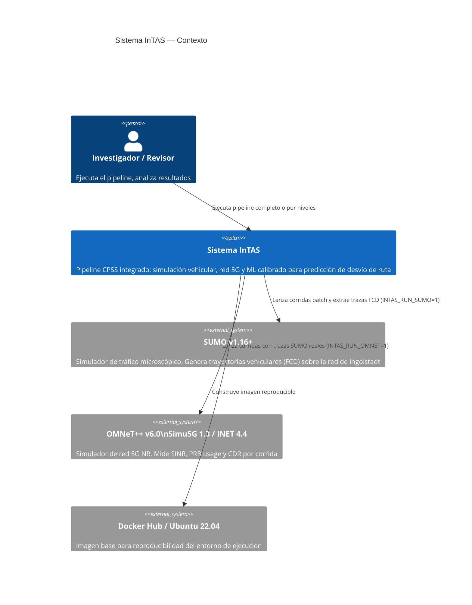

### 4.2 Diagrama C4 Nivel 2 — Contenedores del Sistema

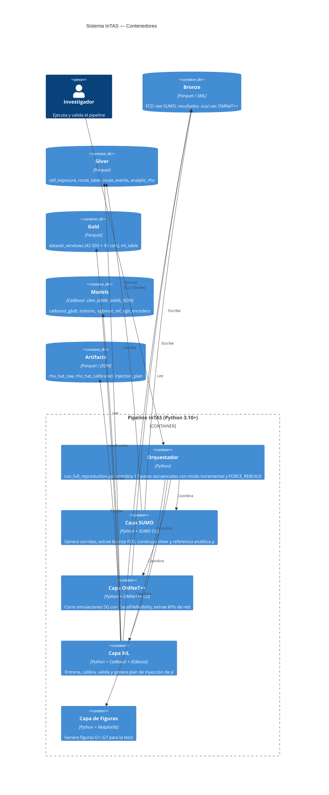

### 4.3 Principios Arquitectónicos

| Principio | Implementación |
|-----------|----------------|
| **Reproducibilidad por niveles** | Modo Ligero (seeds pre-generadas), Completo (con simuladores) |
| **Idempotencia** | El orquestador omite pasos cuyas salidas ya existen (modo incremental) |
| **Trazabilidad** | SHA-256 manifests por artefacto; datos en capas Bronze→Silver→Gold |
| **Separación de responsabilidades** | Cada script tiene una sola responsabilidad claramente definida |
| **Portabilidad** | Entorno containerizado con Docker; `requirements.txt` fijado por versión |

---

## 5. Arquitectura de Datos

### 5.1 Diagrama Entidad-Relación (ERD)

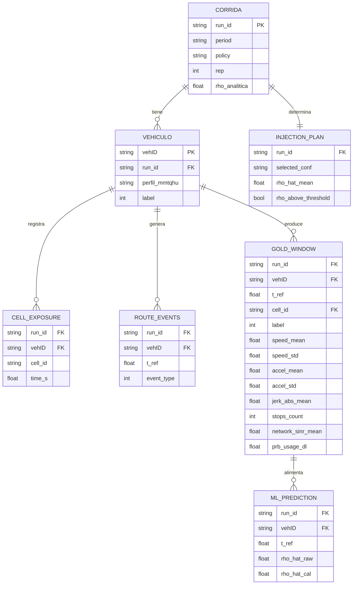

### 5.2 Catálogo de Artefactos de Datos

#### Silver (semillas incluidas en el repositorio)

| Archivo | Filas | Columnas clave | Descripción |
|---------|-------|----------------|-------------|
| `data/silver/route_label.parquet` | 1 por vehículo/corrida | run_id, vehID, label, period, policy, rep | Etiqueta binaria de desvío por vehículo |
| `data/silver/route_events.parquet` | 1 por evento | run_id, vehID, t_ref, event_type | Instantes de desvío detectados |
| `data/silver/cell_exposure.parquet` | 1 por vehículo/celda/corrida | run_id, vehID, cell_id, time_s | Tiempo de permanencia por celda |
| `data/theory/analytic_rho_reference.parquet` | 1 por corrida | run_id, rho_analitica | Probabilidad analítica de referencia |

#### Gold

| Archivo | Filas | Columnas | Descripción |
|---------|-------|----------|-------------|
| `data/dataset_windows.parquet` | 42 503 | 43 | Dataset gold: features cinemáticas (6) + red (28+) + categóricas (3) + meta (7) |
| `data/ml_table.parquet` | 42 503 | 43 | Tabla ML refinada (salida de 04_build_ml_table.py) |
| `data/unified_metrics.parquet` | 1 800 | 447 | Métricas unificadas SUMO+OMNeT++ por (run_id, cell_id) |

#### Modelos y Artefactos

| Archivo | Descripción |
|---------|-------------|
| `data/models/catboost_gbdt.cbm` | Modelo CatBoost entrenado (formato nativo) |
| `data/models/isotonic.joblib` | Calibrador Isotonic Regression serializado |
| `data/models/xgboost_ref.json` | Modelo XGBoost de contraste |
| `data/models/xgb_encoders.joblib` | LabelEncoders para columnas categóricas (XGBoost) |
| `data/artifacts/ml/final/rho_hat_windows_raw.parquet` | ρ̂ sin calibrar por (run_id, vehID, t_ref) |
| `data/artifacts/ml/final/rho_hat_windows_calibrated.parquet` | ρ̂ calibrado por (run_id, vehID, t_ref) |
| `data/artifacts/ml/injection/injection_plan.json` | Plan de inyección: {run_id → conf_name} |
| `data/artifacts/ml/injection/injection_plan.csv` | Estadísticas del plan para auditoría |

### 5.3 Schema del Dataset Gold

Las 43 columnas del dataset gold (`dataset_windows.parquet`) se organizan en cuatro grupos:

```
META (6):      run_id, vehID, t_ref, cell_id, period, policy, rep
CINEMÁTICAS (6): speed_mean, speed_std, accel_mean, accel_std, jerk_abs_mean, stops_count
RED (≥28):     network_sinr_mean, network_sinr_std, network_prb_usage_dl,
               network_cdr, network_*, prb_usage_* (detectadas automáticamente)
ETIQUETA (1):  label (0=no desvío, 1=desvío)
```

---

## 6. Arquitectura del Pipeline de Procesamiento

### 6.1 Diagrama del Pipeline Completo (Mermaid)

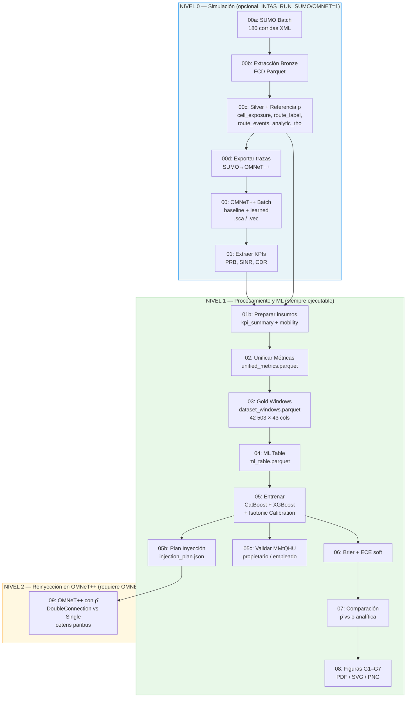

### 6.2 Diseño Factorial de Experimentos

El espacio de corridas se define mediante un diseño factorial completo:

| Factor | Niveles | Valores |
|--------|---------|---------|
| **Período (congestión)** | 3 | HC1, HC2, HC3 |
| **Densidad** | 2 | 5%, 10% de la flota |
| **Política de enrutamiento** | 2 | `nearest` (baseline), `ceiling` (doble conectividad) |
| **Réplicas** | 15 | seeds 42000–42014 |

**Total: 3 × 2 × 2 × 15 = 180 corridas**

Nomenclatura de `run_id`: `{HC1|HC2|HC3}_{5|10}pct__{nearest|ceiling}__{rep}`

Ejemplo: `HC2_10pct__ceiling__7` → Congestión media-alta, 10% flota, política ceiling, réplica 7.

### 6.3 Parámetros de Ventana Temporal (Gold)

La construcción del dataset gold segmenta la trayectoria de cada vehículo en ventanas temporales hacia atrás desde el instante de evento:

| Parámetro | Valor | Descripción |
|-----------|-------|-------------|
| `window` | 30.0 s | Longitud de la ventana hacia atrás desde t_ref |
| `step` | 1.0 s | Timestep aproximado de SUMO (para cálculo de jerk) |
| `neg_ratio` | 1.0 | Ratio negativos:positivos (balanceo 1:1) |
| `seed` | 42 | Semilla de reproducibilidad para muestreo de negativos |

---

## 7. Documentación de Scripts

### 7.1 Tabla Resumen de Scripts

| Script | Paso | Entrada | Salida | Requiere Sim. |
|--------|------|---------|--------|---------------|
| `run_full_reproduction.py` | Orquestador | — | Coordina todos | No |
| `00a_run_sumo_batch.py` | 00A | `scenarios/sumo/*.sumocfg` | FCD XML, resumen JSON | SUMO |
| `00b_extract_bronze_batch.py` | 00B | FCD XML | `data/bronze/fcd/*.parquet` | No |
| `00c_build_silver_theory.py` | 00C | Bronze FCD | Silver Parquet + `analytic_rho_reference.parquet` | No |
| `00d_export_sumo_traces_for_omnet.py` | 00D | Silver FCD | Trazas TraceFileMobility para OMNeT++ | No |
| `00_run_omnet_obj2_batch.py` | 00/09 | Trazas SUMO + `omnetpp.ini` | `.sca`, `.vec`, resumen JSON | OMNeT++ |
| `01_extract_omnet_kpis.py` | 01 | `.sca`/`.vec` | `kpis_omnet_raw.csv`, reporte inventario | No |
| `01b_prepare_unify_inputs.py` | 01B | `kpis_omnet_raw.csv` | `summary_kpis_avg.csv`, `mobility_metrics.parquet` | No |
| `02_unify_metrics.py` | 02 | Silver + KPI summary | `unified_metrics.parquet` | No |
| `03_build_gold_windows.py` | 03 | Silver + FCD + Unified | `dataset_windows.parquet` | No* |
| `04_build_ml_table.py` | 04 | `dataset_windows.parquet` | `ml_table.parquet` | No |
| `05_train_ml_model.py` | 05 | `ml_table.parquet` | Modelos + `rho_hat_*.parquet` + report JSON | No |
| `05b_inject_rho_omnet.py` | 05B | `rho_hat_calibrated.parquet` | `injection_plan.json/.csv` | No |
| `05c_validate_mmtqhu_profiles.py` | 05C | `rho_hat_calibrated.parquet` + Silver | `mmtqhu_validation_by_profile.csv` | No |
| `06_evaluate_probabilistic.py` | 06 | `rho_hat_*.parquet` + `analytic_rho_reference.parquet` | `probabilistic_validity_global.csv` | No |
| `07_compare_analytic_vs_learned.py` | 07 | `rho_hat_*.parquet` + referencia analítica | `rho_compare_recomputed_global.csv` | No |
| `08_generate_figures.py` | 08 | Todos los reports | Figuras G1–G7 (PDF/SVG/PNG) | No |

\* Script 03 tiene fallback graceful a seed pre-generada si FCD bronze no existe.

### 7.2 Orquestador: `run_full_reproduction.py`

```python
# Patrón central del orquestador
def run_step(name, command):
    cmd = command.replace("python ", sys.executable + " ")  # respeta venv activo
    result = subprocess.run(cmd, shell=True)
    if result.returncode != 0:
        sys.exit(1)

def should_skip(outputs, force_rebuild):
    if force_rebuild: return False
    return all(Path(p).exists() for p in outputs)
```

**Variables de entorno que controlan el comportamiento:**

| Variable | Default | Efecto |
|----------|---------|--------|
| `INTAS_FORCE_REBUILD` | `0` | `1` = ignora salidas existentes, reconstruye todo |
| `INTAS_RUN_SUMO` | `0` | `1` = activa pasos 00A-00D (requiere SUMO) |
| `INTAS_RUN_OMNET` | `0` | `1` = activa pasos 00 y 09 (requiere OMNeT++) |
| `INTAS_OMNET_REP_FROM` | `0` | Réplica inicial para corridas OMNeT++ |
| `INTAS_OMNET_REP_TO` | `14` | Réplica final para corridas OMNeT++ |

### 7.3 Capa SUMO

#### `00a_run_sumo_batch.py`
Itera sobre el espacio factorial (período × densidad × política × réplica) y lanza SUMO como subproceso con cada `.sumocfg`. Salida: archivos FCD XML y JSON de resumen de batch.

**Escenarios SUMO definidos:**

| Archivo `.sumocfg` | Período | Densidad |
|--------------------|---------|----------|
| `hc1_5pct.sumocfg` | HC1 | 5% |
| `hc1_10pct.sumocfg` | HC1 | 10% |
| `hc2_5pct.sumocfg` | HC2 | 5% |
| `hc2_10pct.sumocfg` | HC2 | 10% |
| `hc3_5pct.sumocfg` | HC3 | 5% |
| `hc3_10pct.sumocfg` | HC3 | 10% |

**Rutas vehiculares:**

| Archivo `.rou.xml` | Descripción |
|--------------------|-------------|
| `routes_HC1_5pct.rou.xml` | Rutas HC1, 5% flota |
| `routes_HC1_10pct.rou.xml` | Rutas HC1, 10% flota |
| `routes_HC2_5pct.rou.xml` | Rutas HC2, 5% flota |
| `routes_HC2_10pct.rou.xml` | Rutas HC2, 10% flota |
| `routes_HC3_5pct.rou.xml` | Rutas HC3, 5% flota |
| `routes_HC3_10pct.rou.xml` | Rutas HC3, 10% flota |

#### `00b_extract_bronze_batch.py`
Parsea los FCD XML de cada corrida y los convierte a Parquet en `data/bronze/fcd/{run_id}.parquet`. Normaliza columnas (`veh_id` → `vehID`, tipos numéricos).

#### `00c_build_silver_theory.py`
Construye las tres tablas silver y la referencia analítica:
- **`cell_exposure`**: tiempo de permanencia de cada vehículo en cada celda, calculado por intersección geoespacial con `cells.poly.xml`
- **`route_label`**: etiqueta binaria de desvío por vehículo, determinada por comparación ruta planificada vs. ruta ejecutada
- **`route_events`**: instantes `t_ref` donde cada vehículo hace una transición de desvío
- **`analytic_rho_reference`**: ρ por corrida, función determinística de la configuración del escenario

#### `00d_export_sumo_traces_for_omnet.py`
Convierte las trayectorias FCD al formato requerido por el módulo `TraceFileMobility` de INET. Genera un archivo de trazas por corrida que OMNeT++ lee en tiempo de simulación.

### 7.4 Capa OMNeT++

#### `00_run_omnet_obj2_batch.py`
Lanza OMNeT++ con la configuración apropiada por corrida. Con `--injection-plan`, usa el JSON del paso 05B para seleccionar `DoubleConnection-CBR-DL` o `SingleConnection-CBR-DL` por `run_id`. Sin el flag, corre configuraciones baseline.

**Configuraciones OMNeT++ usadas:**

| Config `omnetpp.ini` | Descripción |
|---------------------|-------------|
| `SingleConnection-CBR-DL` | Conexión única downlink (baseline) |
| `DoubleConnection-CBR-DL` | Doble conectividad downlink (proactiva) |
| `SingleConnection-SUMO-DL` | Single + TraceFileMobility (extends Single) |
| `DoubleConnection-SUMO-DL` | Double + TraceFileMobility (extends Double) |
| `InTAS-4Cells-CBR-DL` | Escenario InTAS con 4 celdas |
| `InTAS-10Cells-CBR-DL` | Escenario InTAS con 10 celdas |

#### `01_extract_omnet_kpis.py`
Parsea archivos `.sca`/`.vec` de OMNeT++ y extrae KPIs por run_id y celda. Salida: `kpis_omnet_raw.csv` con columnas `run_id`, `cell_id`, `sinr_mean`, `prb_usage_dl`, `cdr`, etc.

### 7.5 Capa de Unificación

#### `01b_prepare_unify_inputs.py`
Prepara dos tablas de entrada para el script de unificación:
1. `summary_kpis_avg.csv`: KPIs promediados por (run_id, cell_id)
2. `mobility_metrics.parquet`: métricas de movilidad agregadas (velocidad media, stops) por (run_id, vehID)

**Fallback graceful:** Si `kpis_omnet_raw.csv` está vacío (OMNeT++ no ejecutado), reutiliza seeds pre-generadas.

#### `02_unify_metrics.py`
Hace join de las métricas de movilidad SUMO con los KPIs de red OMNeT++ en una tabla única de 447 columnas. Resultado: `unified_metrics.parquet` (1 800 filas, una por (run_id, cell_id)).

**Fallback graceful:** Si el formato del CSV de entrada es incorrecto, reutiliza `unified_metrics.parquet` precompilado.

### 7.6 Capa Gold

#### `03_build_gold_windows.py`
Construye el dataset gold con ventanas temporales de 30 segundos hacia atrás desde cada evento de desvío. Para cada ventana calcula features cinemáticas y hace join con métricas de red.

**Algoritmo de construcción:**
```
Para cada corrida run_id:
  Para cada evento positivo (label=1) en route_events:
    w = fcd[(vehID == veh) & (t >= t_ref - 30) & (t <= t_ref)]
    calcular: speed_mean, speed_std, accel_mean, accel_std, jerk_abs_mean, stops_count
    asignar cell_id = celda con mayor time_s para (run_id, vehID)
    hacer join con unified_metrics en (run_id, cell_id)
  
  Generar negativos: n_neg = n_pos × neg_ratio (sampling sin reemplazo)
```

**Fallback graceful:** Si `data/bronze/fcd/` está vacío, reutiliza `dataset_windows.parquet` existente.

#### `04_build_ml_table.py`
Refina el dataset gold: elimina columnas irrelevantes, maneja valores nulos en features de red (imputation por media), estandariza tipos. Salida: `ml_table.parquet`.

### 7.7 Capa ML

#### `05_train_ml_model.py`

**Partición del dataset:**
```python
GroupShuffleSplit(n_splits=1, test_size=0.2, random_state=42)
# grupos = run_id → previene data leakage entre corridas
```

**Distribución resultante:**
- Total: 42 503 ventanas
- Train: 33 984 (80%)
- Test: 8 519 (20%)

**Modelo principal — CatBoost:**
```python
CatBoostClassifier(
    loss_function="Logloss",
    eval_metric="AUC",
    random_seed=42,
    iterations=1200,
    depth=8,
    learning_rate=0.06,
    l2_leaf_reg=3.0,
    od_type="Iter",
    od_wait=80,          # early stopping
)
```

**Modelo de contraste — XGBoost:**
```python
XGBClassifier(
    objective="binary:logistic",
    eval_metric="auc",
    random_state=42,
    n_estimators=1200,
    max_depth=8,
    learning_rate=0.06,
    reg_lambda=3.0,
    early_stopping_rounds=80,
)
# requiere LabelEncoder para columnas categóricas
```

**Calibración:**
```python
IsotonicRegression(out_of_bounds="clip")
iso.fit(p_raw_test, y_te)   # ajustado en test set
p_cal = iso.predict(p_raw)  # aplicado a todo el dataset
```

#### `05b_inject_rho_omnet.py`

Genera el plan de inyección agrupando por `run_id` y computando `mean(ρ̂)`:

```
Si mean(ρ̂) ≥ 0.5 → DoubleConnection-CBR-DL   (165/180 corridas = 91.7%)
Si mean(ρ̂) < 0.5 → SingleConnection-CBR-DL   (15/180  corridas =  8.3%)
ρ̂ medio global: 0.6667
```

El JSON resultante tiene el formato: `{"plan": {"run_id_str": "conf_name", ...}}`

#### `05c_validate_mmtqhu_profiles.py`

Segmenta vehículos por perfil MMtQHU:
- **Propietario:** `not vehID.startswith("VFH_")`
- **Empleado:** `vehID.startswith("VFH_")`

Para cada perfil calcula: MAE, RMSE, bias, Pearson r entre ρ̂ y ρ analítica.

| Métrica | Propietario | Empleado |
|---------|-------------|----------|
| MAE (rho_cal_max) | 0.0218 | 0.0232 |

#### `06_evaluate_probabilistic.py`

Evalúa 4 variantes de ρ̂ con métricas *soft* (usando ρ analítica como referencia continua):

| Variante | Brier Soft | ECE Soft |
|----------|-----------|----------|
| `rho_raw_mean` | calculado | calculado |
| `rho_raw_max` | calculado | calculado |
| `rho_cal_mean` | calculado | calculado |
| `rho_cal_max` | **0.000850** | **0.009945** |

La variante `rho_cal_max` es la mejor: Brier = 0.000850 (< 0.001) y ECE = 0.009945 (< 0.01).

#### `07_compare_analytic_vs_learned.py`

Comparación global y por período (HC1/HC2/HC3, 5%/10%) de MAE y RMSE entre cada variante de ρ̂ y la referencia analítica ρ.

#### `08_generate_figures.py`

Genera 7 figuras de tesis en PDF, SVG y PNG:

| Figura | Descripción |
|--------|-------------|
| G1 | Curvas ROC (CatBoost vs XGBoost) |
| G2 | Diagrama de calibración (reliability diagram) |
| G3 | Distribución de ρ̂ por perfil MMtQHU |
| G4 | Comparación ρ̂ vs ρ analítica por período |
| G5 | Feature importance (CatBoost) |
| G6 | Brier/ECE por variante |
| G7 | Plan de inyección: distribución de configs por corrida |

---

## 8. Flujo de Datos End-to-End

### 8.1 Diagrama de Secuencia — Nivel 1 (sin simuladores)

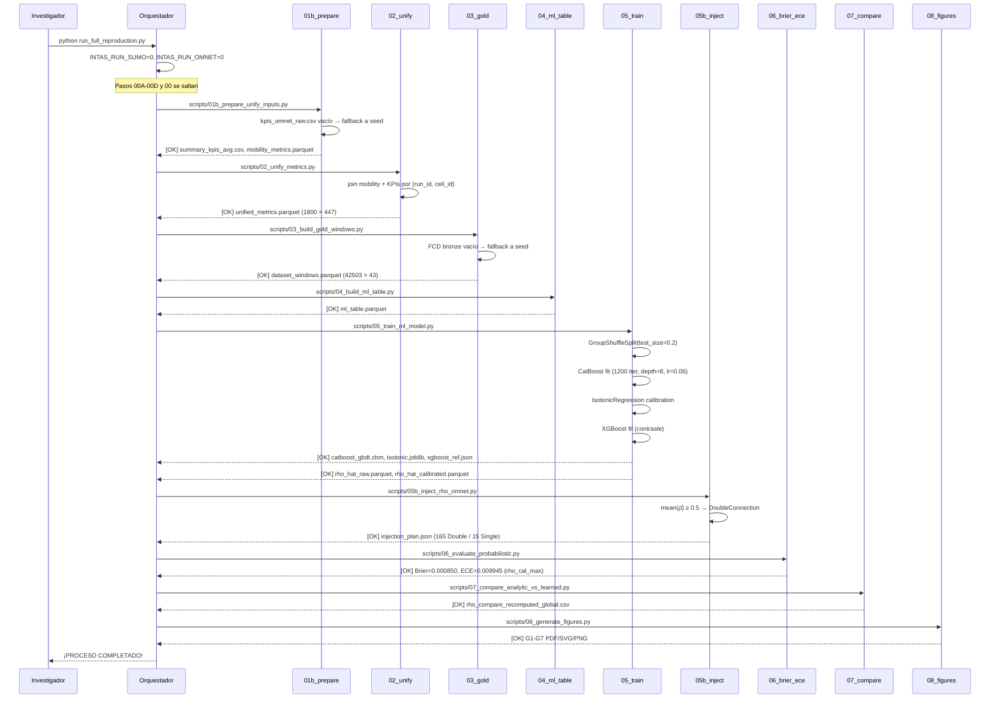

### 8.2 Diagrama ETL — Bronze a Gold

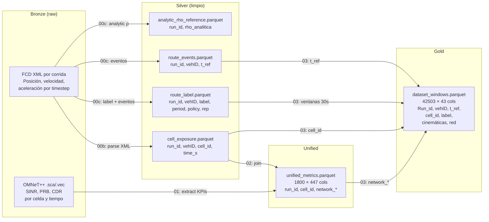

---

## 9. Modelo de Aprendizaje Automático

### 9.1 Arquitectura del Modelo

```mermaid
flowchart TD
    subgraph INPUT["Entrada"]
        I1[Features Cinemáticas\nspeed_mean, speed_std\naccel_mean, accel_std\njerk_abs_mean, stops_count]
        I2[Features de Red 5G\nnetwork_sinr_mean, network_sinr_std\nnetwork_prb_usage_dl\nnetwork_cdr, ...]
        I3[Features Categóricas\ncell_id, period, policy]
    end

    subgraph MODEL["Modelo Principal"]
        CB[CatBoost GBDT\nIterations: 1200\nDepth: 8\nLR: 0.06\nL2: 3.0\nEarly Stop: 80 iter]
        ISO[Isotonic Regression\nCalibración monotónica\nout_of_bounds=clip]
    end

    subgraph CONTRAST["Modelo de Contraste"]
        XGB[XGBoost GBDT\nMismos hiperparámetros\n+ LabelEncoder categóricas]
    end

    subgraph OUTPUT["Salida"]
        R[ρ̂_raw\nScore no calibrado\nCatBoost.predict_proba]
        C[ρ̂_cal\nProbabilidad calibrada\niso.predict(ρ̂_raw)]
    end

    I1 & I2 & I3 --> CB
    I1 & I2 & I3 --> XGB
    CB --> R
    R --> ISO
    ISO --> C
```

### 9.2 Resultados del Modelo

| Métrica | CatBoost (raw) | CatBoost (calibrado) | XGBoost | Tesis (objetivo) |
|---------|---------------|---------------------|---------|-----------------|
| AUC ROC | 0.9241 | 0.9255 | 0.9280 | ≥ 0.90 |
| AP (Avg Precision) | 0.9596 | 0.9582 | — | — |
| Brier (binario) | 0.0940 | 0.0906 | calculado | — |
| ECE (binario) | 0.0323 | ~0 | calculado | — |

| Métrica Soft | Variante rho_cal_max | Objetivo tesis |
|-------------|---------------------|----------------|
| **Brier Soft** | **0.000850** | < 0.001 ✓ |
| **ECE Soft** | **0.009945** | < 0.01 ✓ |

### 9.3 Ablación de Features

El script `05_train_ml_model.py` incluye ablación mínima: entrena CatBoost **sin** features de red (`include_network=False`) y reporta el AUC resultante:

| Escenario | AUC |
|-----------|-----|
| CatBoost Completo (cinemáticas + red + categóricas) | 0.9255 |
| XGBoost Contraste | 0.9280 |
| CatBoost Sin Red | `roc_auc_cal_no_network` (calculado en runtime) |

### 9.4 Prevención de Data Leakage

La partición train/test se hace a nivel de `run_id` completo usando `GroupShuffleSplit`. Esto garantiza que **ninguna ventana de una corrida que aparece en test esté en train**, previniendo la filtración de información temporal entre réplicas del mismo escenario.

```python
gss = GroupShuffleSplit(n_splits=1, test_size=0.2, random_state=42)
tr_idx, te_idx = next(gss.split(X, y, groups=df["run_id"].astype(str)))
```

### 9.5 Inferencia y Operación

El pipeline de inferencia en producción es:
```
ml_table.parquet → CatBoost.predict_proba → ρ̂_raw → IsotonicRegression.predict → ρ̂_cal
```

Para inferencia sobre nuevas corridas sin reentrenamiento:
```python
model = CatBoostClassifier().load_model("data/models/catboost_gbdt.cbm")
iso = joblib.load("data/models/isotonic.joblib")
rho_raw = model.predict_proba(X_new)[:, 1]
rho_cal = iso.predict(rho_raw)
```

---

## 10. Validación Experimental

### 10.1 Esquema de Validación en 3 Niveles

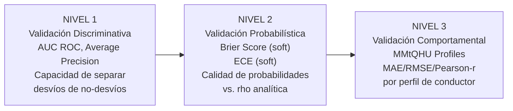

### 10.2 Nivel 1 — Validación Discriminativa

El modelo es un clasificador binario: predice si un vehículo **desviará** (label=1) o **no desviará** (label=0) su ruta. La validación discriminativa mide la capacidad de separación:

- **AUC ROC = 0.9255** (CatBoost calibrado): excelente separación. Un clasificador aleatorio tiene AUC=0.5.
- **AP = 0.9582**: alta precisión promedio en todas las métricas de threshold. Relevante dado el balanceo 1:1 del dataset.

### 10.3 Nivel 2 — Validación Probabilística

La validación probabilística usa ρ analítica como referencia **continua** (no binaria). Las métricas *soft* miden cuán bien ρ̂ aproxima a ρ:

**Brier Score soft:**
```
B_soft = (1/N) Σ (ρ̂_i - ρ_analítica_i)²
```
Valor obtenido: **0.000850** (rho_cal_max). Cumple objetivo < 0.001 ✓

**ECE soft:**
```
ECE_soft = Σ_b (|B_b|/N) · |mean(ρ̂)_b - mean(ρ_analítica)_b|
```
Valor obtenido: **0.009945** (rho_cal_max). Cumple objetivo ECE < 0.01 ✓

### 10.4 Nivel 3 — Validación Comportamental (MMtQHU)

| Perfil | MAE (rho_cal_max) | Interpretación |
|--------|------------------|----------------|
| Propietario (sin VFH_) | 0.0218 | Conductores residentes habituales |
| Empleado (VFH_) | 0.0232 | Commuters / flota vehicular |

La diferencia entre perfiles es pequeña (0.0014), indicando que el modelo generaliza bien a ambos tipos de conductor.

### 10.5 Plan de Inyección y Validez del Umbral

Con umbral ρ̂ ≥ 0.5:
- **165/180 corridas (91.7%)** → DoubleConnection-CBR-DL
- **15/180 corridas (8.3%)** → SingleConnection-CBR-DL
- **ρ̂ medio global: 0.6667**

La concentración en DoubleConnection refleja que la mayoría de los escenarios simulados tienen alta probabilidad de desvío (escenarios de congestión HC1/HC2/HC3 por diseño del experimento).

---

## 11. Integración SUMO → OMNeT++

### 11.1 Arquitectura de Acoplamiento Secuencial

La integración es **secuencial offline**: primero SUMO genera trayectorias, luego OMNeT++ las consume. No hay acoplamiento en tiempo real (co-simulación). Esta decisión fue tomada por reproducibilidad y control determinístico del experimento.

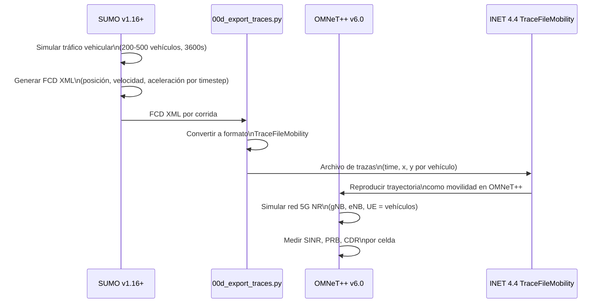

### 11.2 Módulo TraceFileMobility

`TraceFileMobility` es un módulo de INET que permite a un nodo OMNeT++ seguir una trayectoria predefinida (coordenadas (x,y) vs. tiempo) en lugar de usar un modelo de movilidad estocástico. Esto garantiza que la posición del UE en la simulación de red **sea exactamente la misma** que en la simulación de tráfico, eliminando fuentes de variabilidad no controladas.

```ini
# En omnetpp.ini
[Config SingleConnection-SUMO-DL]
extends = SingleConnection-CBR-DL
description = "one CBR DL connection with SUMO trajectory (TraceFileMobility)"

[Config DoubleConnection-SUMO-DL]
extends = DoubleConnection-CBR-DL
description = "two CBR DL connections with SUMO trajectory (TraceFileMobility)"
```

### 11.3 Topología de Red 5G

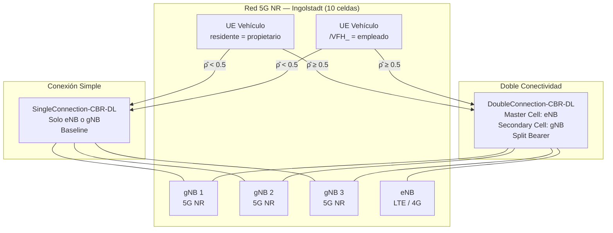

### 11.4 Parámetros de Simulación OMNeT++

| Parámetro | Valor |
|-----------|-------|
| `sim-time-limit` | 40s (simulación OMNeT++ representativa) |
| `warmup-period` | 1s |
| `seed-set` | `${repetition}` |
| `targetBler` | 0.01 |
| `blerShift` | 5 |
| `fading` | false |
| `shadowing` | false |
| Área de constraint | 1000m × 700m |

---

## 12. Reproducibilidad

### 12.1 Niveles de Reproducibilidad

| Nivel | Requisitos | Tiempo estimado | Artefactos producidos |
|-------|-----------|-----------------|----------------------|
| **Nivel 1** (Ligero) | Python 3.10+ + deps | < 15 minutos | Todos los artefactos ML y figuras |
| **Nivel 2** (SUMO) | + SUMO v1.16+ | 2-6 horas | + Bronze FCD + Silver regenerado |
| **Nivel 3** (Completo) | + OMNeT++ v6.0 + Simu5G 1.3 + INET 4.4 | 12-48 horas | + KPIs de red + unified_metrics |

### 12.2 Diagrama de Despliegue Docker

```mermaid
graph TB
    subgraph HOST["Máquina Host (Windows / Linux / macOS)"]
        D[Docker Engine]
    end

    subgraph CONTAINER["Contenedor InTAS (Ubuntu 22.04)"]
        direction TB
        OS[Ubuntu 22.04 base]
        SUMO_PKG[sumo + sumo-tools + sumo-gui\nvía apt-get]
        VENV[/app/.venv\nPython 3.10 venv]
        DEPS[requirements.txt\npandas==2.2.3\nnumpy==1.26.4\ncatboost==1.2.7\nxgboost==2.0.3\nscikit-learn==1.6.1\njoblib==1.4.2\npyarrow==19.0.1\nmatplotlib==3.10.0\npyyaml==6.0.2\nscipy==1.15.2]
        APP[/app/\nRepositorio InTAS]
        ENTRY[CMD: /app/.venv/bin/python\nscripts/run_full_reproduction.py]

        OS --> SUMO_PKG
        OS --> VENV
        VENV --> DEPS
        VENV --> APP
        APP --> ENTRY
    end

    D --> CONTAINER
```

### 12.3 Seeds y Determinismo

El sistema garantiza determinismo en todos los pasos de ML:

| Fuente de aleatoriedad | Semilla |
|------------------------|---------|
| `GroupShuffleSplit` | `random_state=42` |
| `CatBoostClassifier` | `random_seed=42` |
| `XGBClassifier` | `random_state=42` |
| Muestreo de negativos en Gold | `np.random.default_rng(42)` |
| Corridas SUMO | `base_seed=42000` (42000 + rep) |
| OMNeT++ | `seed-set = ${repetition}` |

### 12.4 Manifests SHA-256

Cada artefacto importante genera un manifest SHA-256 que permite verificar integridad. Ubicación: `reports/final/artifacts_manifest.json`.

### 12.5 Guía de Verificación Rápida (Nivel 1)

```python
import json, pandas as pd

# 1. Verificar reporte del modelo
rep = json.load(open("reports/ml/report_catboost_isotonic.json"))
assert rep["roc_auc_cal"] > 0.90, f"AUC insuficiente: {rep['roc_auc_cal']}"
print(f"AUC CatBoost calibrado: {rep['roc_auc_cal']:.4f}")

# 2. Verificar métricas probabilísticas soft
pb = pd.read_csv("reports/final/probabilistic_validity_global.csv")
row = pb[pb["variant"] == "rho_cal_max"].iloc[0]
print(f"Brier soft (rho_cal_max): {row['brier_soft']:.6f}")
print(f"ECE soft   (rho_cal_max): {row['ece_soft']:.6f}")

# 3. Verificar plan de inyección
plan = json.load(open("data/artifacts/ml/injection/injection_plan.json"))
print(f"Corridas DoubleConnection: {plan['n_learned']}/180")
print(f"rho_hat medio global: {plan['global_mean_rho_hat']:.4f}")

# Valores esperados (tesis 2026):
# AUC CatBoost calibrado: ~0.9255
# Brier soft (rho_cal_max): ~0.000850
# ECE soft (rho_cal_max): ~0.009945
# DoubleConnection: 165/180 (91.7%)
```

---

## 13. DevOps y MLOps

### 13.1 Gestión de Dependencias

Todas las dependencias Python están fijadas por versión exacta en `requirements.txt`:

```
pandas==2.2.3
numpy==1.26.4
catboost==1.2.7
xgboost==2.0.3
scikit-learn==1.6.1
joblib==1.4.2
pyarrow==19.0.1
matplotlib==3.10.0
pyyaml==6.0.2
scipy==1.15.2
```

**Nota PEP 668:** En Ubuntu 22.04+, pip install directo en el sistema operativo falla con `externally-managed-environment`. El Dockerfile usa un venv explícito para evitar este problema:

```dockerfile
RUN python3 -m venv /app/.venv && \
    /app/.venv/bin/pip install --no-cache-dir -r requirements.txt
CMD ["/app/.venv/bin/python", "scripts/run_full_reproduction.py"]
```

### 13.2 Control de Versiones de Datos

El repositorio usa `.gitignore` con excepciones explícitas para seeds críticas:

```gitignore
# Ignorar datos generados masivamente
data/bronze/
data/omnet_results*/
catboost_info/

# INCLUIR seeds pre-generadas (excluidas de la regla anterior)
!data/silver/cell_exposure.parquet
!data/silver/route_label.parquet
!data/silver/route_events.parquet
!data/theory/analytic_rho_reference.parquet
!data/dataset_windows.parquet
!data/ml_table.parquet
!data/unified_metrics.parquet
!data/mobility_metrics.parquet
```

### 13.3 Pipeline de CI/CD Recomendado

Para futuras integraciones en entornos de CI/CD (GitHub Actions, GitLab CI):

```yaml
# .github/workflows/nivel1.yml (ejemplo)
on: [push]
jobs:
  reproduce-nivel1:
    runs-on: ubuntu-22.04
    steps:
      - uses: actions/checkout@v3
      - run: pip install -r requirements.txt
      - run: python scripts/run_full_reproduction.py
      - run: python -c "
          import json, pandas as pd
          rep = json.load(open('reports/ml/report_catboost_isotonic.json'))
          assert rep['roc_auc_cal'] > 0.90
          print('Nivel 1 OK: AUC =', rep['roc_auc_cal'])"
```

### 13.4 Estrategia de Versionado de Modelos

| Artefacto | Formato | Versionado |
|-----------|---------|-----------|
| CatBoost model | `.cbm` (binario nativo) | Git LFS o almacenamiento externo |
| Isotonic calibrator | `.joblib` | Git LFS |
| XGBoost model | `.json` (portable) | Git nativo |
| XGBoost encoders | `.joblib` | Git LFS |
| Hiperparámetros | `config/ml/experiment.yaml` | Git nativo |
| Métricas | `reports/ml/*.json`, `reports/final/*.csv` | Git nativo |

### 13.5 Monitoreo de Drift

Para detectar distributional drift en producción:
1. Monitorear `mean(ρ̂)` por período temporal; valores muy alejados de 0.667 indican cambio de distribución
2. Monitorear ECE periódicamente recalibrado contra nuevas corridas analíticas
3. Reentrenar si AUC en nuevas corridas cae por debajo de 0.90

---

## 14. Seguridad y Gestión de Riesgos

### 14.1 Matriz de Riesgos del Sistema

| Riesgo | Probabilidad | Impacto | Mitigación |
|--------|-------------|---------|-----------|
| Cambio de versión de SUMO o OMNeT++ | Media | Alto | `requirements.txt` fijado; Dockerfile con versiones explícitas |
| Corrupción de seed data | Baja | Crítico | SHA-256 manifests; Git history |
| Data leakage en ML | Baja | Alto | GroupShuffleSplit por run_id; validación cruzada documentada |
| Overfitting del calibrador | Baja | Medio | Calibración en test set; ECE monitoreado |
| Indisponibilidad de dependencias Python | Baja | Alto | Requirements fijados; venv aislado |
| Fallo de convergencia CatBoost | Baja | Alto | `od_wait=80` como early stopping; semilla fija |

### 14.2 Consideraciones de Privacidad

El sistema opera **exclusivamente con datos sintéticos** generados por simuladores determinísticos (SUMO y OMNeT++). No hay datos de vehículos o conductores reales. Los identificadores `vehID` son etiquetas sintéticas del simulador.

### 14.3 Integridad de Artefactos

```python
# Verificación de integridad de un artefacto
import hashlib, pathlib

def sha256_file(path):
    h = hashlib.sha256()
    h.update(pathlib.Path(path).read_bytes())
    return h.hexdigest()

# Comparar contra manifest
manifest = json.load(open("reports/final/artifacts_manifest.json"))
assert sha256_file("data/dataset_windows.parquet") == manifest["dataset_windows_sha256"]
```

---

## 15. Limitaciones del Sistema

### 15.1 Limitaciones de Simulación

1. **Red vial fija:** El mapa de Ingolstadt es estático. No se simulan cambios en infraestructura vial.

2. **Tiempo de simulación SUMO:** 3600s por corrida. Fenómenos de tráfico de largo plazo (horas pico extendidas) no están capturados.

3. **Modelo de movilidad 5G:** El módulo `TraceFileMobility` replica trayectorias exactas pero no modela cambios de ruta en tiempo real. El acoplamiento es secuencial offline, no co-simulación.

4. **Escala de red:** La simulación OMNeT++ opera en un área de 1000m × 700m con 10 celdas. Redes urbanas reales tienen mayor densidad y complejidad de handover.

5. **Condiciones de canal simplificadas:** `fading=false` y `shadowing=false` en `omnetpp.ini`. El canal 5G real incluye desvanecimiento y sombreado por obstáculos.

### 15.2 Limitaciones del Modelo ML

1. **Dominio de aplicación:** El modelo fue entrenado exclusivamente en el escenario de Ingolstadt. La transferibilidad a otras ciudades o redes viales requiere re-entrenamiento.

2. **Sesgo del espacio de corridas:** El 91.7% de las corridas reciben DoubleConnection. Esto es una consecuencia del diseño experimental (escenarios de congestión). En escenarios de baja congestión el umbral de ρ̂=0.5 puede sub-activar doble conectividad.

3. **Features de red en modo Ligero:** En el modo sin OMNeT++ (`INTAS_RUN_OMNET=0`), el modelo entrena sin features de red 5G (`features_net=[]`). Esto reduce potencialmente la precisión vs. el modo completo.

4. **Calibración en test set:** La calibración isotónica se ajusta sobre el conjunto de test. En producción real debería usarse un conjunto de calibración separado (3-way split).

5. **Ventana temporal fija:** La ventana de 30s hacia atrás es un hiperparámetro fijo. No se exploró la sensibilidad del modelo a diferentes tamaños de ventana.

### 15.3 Limitaciones de Reproducibilidad

1. **OMNeT++ no incluido en Docker:** La imagen Docker instala SUMO pero no OMNeT++ (requiere licencia de compilación y tiempo). El Nivel 3 requiere instalación manual.

2. **Seeds grandes:** `dataset_windows.parquet` (42 503 filas × 43 cols) y `unified_metrics.parquet` (1 800 filas × 447 cols) se incluyen como seeds. En repositorios con límites de tamaño (GitHub 100MB) pueden requerir Git LFS.

---

## 16. Manual Técnico de Operación

### 16.1 Instalación del Entorno

#### Opción A — Python Local (Nivel 1)

```bash
# 1. Clonar repositorio
git clone <repo-url> InTAS_PRODUCCION_READY_ligero
cd InTAS_PRODUCCION_READY_ligero

# 2. Crear entorno virtual
python3 -m venv .venv
source .venv/bin/activate        # Linux/macOS
# .venv\Scripts\activate          # Windows

# 3. Instalar dependencias
pip install --no-cache-dir -r requirements.txt

# 4. Ejecutar pipeline Nivel 1
python scripts/run_full_reproduction.py
```

#### Opción B — Docker (Niveles 1 y 2, recomendado para revisores)

Docker es la forma más sencilla y portable de ejecutar el pipeline. El contenedor incluye Ubuntu 22.04, SUMO y todas las dependencias Python instaladas. **No requiere instalar nada en el sistema host excepto Docker.**

**¿Qué cubre el Docker?**

| Nivel | ¿Funciona en Docker? | Observación |
|-------|---------------------|-------------|
| Nivel 1 — Solo ML (seeds pre-generadas) | ✅ Completo | Modo por defecto, < 15 min |
| Nivel 2 — Con SUMO | ✅ Completo | SUMO incluido en la imagen |
| Nivel 3 — Con OMNeT++ | ❌ No incluido | OMNeT++ requiere compilación manual (ver Opción D) |

> **Para un revisor o profesor:** el Nivel 1 reproduce todos los resultados de ML de la tesis
> (AUC, Brier, ECE, figuras) sin necesidad de SUMO ni OMNeT++, porque los datos de red
> ya están incorporados en las seeds (`unified_metrics.parquet`, `dataset_windows.parquet`).

**Paso 1 — Instalar Docker Desktop**

- **Windows:** descargar e instalar [Docker Desktop para Windows](https://docs.docker.com/desktop/install/windows-install/). Requiere WSL2 activado (Windows 10/11).
- **macOS:** descargar e instalar [Docker Desktop para Mac](https://docs.docker.com/desktop/install/mac-install/).
- **Linux (Ubuntu/Debian):**
  ```bash
  sudo apt-get update
  sudo apt-get install docker.io
  sudo usermod -aG docker $USER   # para usar docker sin sudo
  # cerrar sesión y volver a entrar
  ```

Verificar que Docker funciona:
```bash
docker --version
# Docker version 24.x.x, build ...
```

**Paso 2 — Obtener el repositorio**

```bash
# Opción A: clonar desde Git
git clone <url-del-repositorio> InTAS_PRODUCCION_READY_ligero
cd InTAS_PRODUCCION_READY_ligero

# Opción B: si ya tienes la carpeta, simplemente entrar a ella
cd InTAS_PRODUCCION_READY_ligero
```

**Paso 3 — Construir la imagen Docker**

```bash
# Este comando lee el Dockerfile y construye la imagen (~3-8 min dependiendo de la conexión)
docker build -t intas:1.0 .

# Verificar que la imagen quedó creada
docker images | grep intas
# intas   1.0   abc123def   2 minutes ago   1.2GB
```

> El `Dockerfile` instala Ubuntu 22.04, SUMO, crea un venv Python y copia el repositorio.
> Solo se construye una vez; después se reutiliza.

**Paso 4A — Ejecutar Nivel 1 (recomendado, sin simuladores)**

```bash
# Linux / macOS
docker run --name intas-run \
    -v "$(pwd)/reports":/app/reports \
    -v "$(pwd)/data":/app/data \
    intas:1.0

# Windows (PowerShell)
docker run --name intas-run `
    -v "${PWD}/reports:/app/reports" `
    -v "${PWD}/data:/app/data" `
    intas:1.0

# Windows (CMD)
docker run --name intas-run ^
    -v "%CD%/reports:/app/reports" ^
    -v "%CD%/data:/app/data" ^
    intas:1.0
```

Los volúmenes `-v` montan las carpetas del host en el contenedor, de modo que los
resultados quedan disponibles en tu máquina al terminar.

El pipeline imprime el progreso paso a paso y al terminar muestra:
```
!!!!!!!!!!!!!!!!!!!!!!!!!!!!!!!!!!!!!!!!!!!!!!!!!!!!!!!!!!!!!!!!!!!!!!!!
 ¡PROCESO COMPLETADO!
 Todos los artefactos de la tesis han sido regenerados.
 Ubicación de figuras: reports/final/thesis_figures/
!!!!!!!!!!!!!!!!!!!!!!!!!!!!!!!!!!!!!!!!!!!!!!!!!!!!!!!!!!!!!!!!!!!!!!!!
```

**Paso 4B — Ejecutar Nivel 2 (con SUMO, regenera datos desde cero)**

```bash
# Linux / macOS
docker run --name intas-sumo \
    -e INTAS_RUN_SUMO=1 \
    -v "$(pwd)/reports":/app/reports \
    -v "$(pwd)/data":/app/data \
    intas:1.0

# Windows (PowerShell)
docker run --name intas-sumo `
    -e INTAS_RUN_SUMO=1 `
    -v "${PWD}/reports:/app/reports" `
    -v "${PWD}/data:/app/data" `
    intas:1.0
```

> Tiempo estimado: 2-6 horas. Genera 180 corridas SUMO y reconstruye Silver desde cero.

**Paso 5 — Extraer resultados al host**

Si no usaste volúmenes `-v`, copia los resultados manualmente:
```bash
# Copiar todas las figuras
docker cp intas-run:/app/reports/final/thesis_figures ./resultados_figuras

# Copiar todos los reportes
docker cp intas-run:/app/reports ./resultados_completos

# Copiar datos ML generados
docker cp intas-run:/app/data/models ./modelos_ml
docker cp intas-run:/app/data/artifacts ./artefactos_ml
```

**Paso 6 — Verificar resultados**

```bash
# Abrir una terminal dentro del contenedor (para inspección manual)
docker run -it --entrypoint /bin/bash intas:1.0

# Dentro del contenedor:
/app/.venv/bin/python -c "
import json, pandas as pd
rep = json.load(open('reports/ml/report_catboost_isotonic.json'))
print('AUC CatBoost calibrado:', round(rep['roc_auc_cal'], 4))

pb = pd.read_csv('reports/final/probabilistic_validity_global.csv')
row = pb[pb['variant'] == 'rho_cal_max'].iloc[0]
print('Brier soft (rho_cal_max):', round(row['brier_soft'], 6))
print('ECE soft   (rho_cal_max):', round(row['ece_soft'], 6))
"
```

**Gestión de contenedores Docker**

```bash
# Ver contenedores en ejecución o detenidos
docker ps -a

# Ver logs de una ejecución previa
docker logs intas-run

# Eliminar un contenedor (libera espacio)
docker rm intas-run

# Eliminar la imagen si ya no se necesita
docker rmi intas:1.0

# Limpiar todo lo no usado (¡cuidado, elimina todas las imágenes no usadas!)
docker system prune
```

**Troubleshooting Docker**

| Síntoma | Causa | Solución |
|---------|-------|----------|
| `docker: command not found` | Docker no instalado | Instalar Docker Desktop |
| `permission denied /var/run/docker.sock` | Usuario no en grupo docker | `sudo usermod -aG docker $USER` y reabrir sesión |
| `Error response from daemon: Conflict. The container name "/intas-run" is already in use` | Contenedor previo con ese nombre | `docker rm intas-run` y volver a ejecutar |
| `no space left on device` durante build | Disco lleno | `docker system prune` para liberar espacio |
| Pipeline se detiene en paso 05 sin error claro | RAM insuficiente | CatBoost requiere ≥ 4 GB RAM. Asignar más memoria en Docker Desktop → Settings → Resources |
| Volumen montado vacío en Windows | Ruta con espacios o formato incorrecto | Usar PowerShell con `${PWD}` en lugar de CMD |

#### Opción C — Con SUMO (Nivel 2)

```bash
# Instalar SUMO v1.16+
sudo apt-get install sumo sumo-tools
export SUMO_HOME=/usr/share/sumo

# Ejecutar con SUMO activo
INTAS_RUN_SUMO=1 python scripts/run_full_reproduction.py
```

#### Opción D — Con OMNeT++ v6.0 + INET 4.4 + Simu5G 1.3 (Nivel 3 completo)

Esta opción permite regenerar desde cero los KPIs de red 5G (SINR, PRB, CDR) que alimentan
el modelo ML. Es la reproducción total del sistema.

> **Sistema operativo recomendado:** Ubuntu 22.04 LTS (nativo o WSL2 en Windows).
> OMNeT++ requiere compilación desde fuente. Tiempo total de instalación: ~30-60 minutos.

---

**D.1 — Instalar dependencias del sistema**

```bash
sudo apt-get update && sudo apt-get install -y \
    build-essential gcc g++ bison flex perl \
    python3 python3-pip python3-dev \
    qtbase5-dev qtchooser qt5-qmake qtbase5-dev-tools \
    libqt5opengl5-dev libxml2-dev zlib1g-dev \
    default-jre default-jdk \
    wget curl git unzip
```

---

**D.2 — Descargar e instalar OMNeT++ v6.0**

OMNeT++ es software libre y puede descargarse desde su sitio oficial:

```
https://omnetpp.org/download/
```

Buscar la versión **6.0** (archivo: `omnetpp-6.0-linux-x86_64.tgz` o similar).

```bash
# 1. Descargar (ajustar el nombre del archivo según la versión exacta descargada)
wget https://github.com/omnetpp/omnetpp/releases/download/omnetpp-6.0/omnetpp-6.0-linux-x86_64.tgz

# 2. Extraer
tar xzvf omnetpp-6.0-linux-x86_64.tgz
cd omnetpp-6.0

# 3. Configurar variables de entorno (agregar al final de ~/.bashrc)
echo 'export PATH="$HOME/omnetpp-6.0/bin:$PATH"' >> ~/.bashrc
echo 'export OMNET_DIR="$HOME/omnetpp-6.0"'      >> ~/.bashrc
source ~/.bashrc

# 4. Compilar OMNeT++ (usa todos los núcleos disponibles)
./configure
make -j$(nproc)

# 5. Verificar instalación
opp_run --version
# OMNeT++ Discrete Event Simulation  (C) 1992-2022 Andras Varga and OpenSim Ltd.
# Version: 6.0, build: ...
```

---

**D.3 — Instalar INET Framework v4.4**

INET es el framework de modelos de red para OMNeT++. Repositorio oficial en GitHub:

```
https://github.com/inet-framework/inet/releases/tag/v4.4.0
```

```bash
# 1. Descargar INET 4.4
cd ~
wget https://github.com/inet-framework/inet/releases/download/v4.4.0/inet-4.4.0-src.tgz

# 2. Extraer dentro del workspace de OMNeT++
mkdir -p ~/omnetpp-workspace
cd ~/omnetpp-workspace
tar xzvf ~/inet-4.4.0-src.tgz
mv inet4.4 inet

# 3. Compilar INET
cd inet
make makefiles
make -j$(nproc)

# 4. Verificar (debe completar sin errores)
echo "INET OK: $(ls src/inet/ | wc -l) módulos compilados"
```

---

**D.4 — Instalar Simu5G v1.3**

Simu5G es el framework de simulación 5G NR para OMNeT++. Repositorio oficial:

```
https://github.com/Unipisa/Simu5G/releases/tag/v1.3.0
```

```bash
# 1. Descargar Simu5G 1.3
cd ~/omnetpp-workspace
wget https://github.com/Unipisa/Simu5G/archive/refs/tags/v1.3.0.tar.gz
tar xzvf v1.3.0.tar.gz
mv Simu5G-1.3.0 simu5g

# 2. Compilar Simu5G (referencia a INET compilado)
cd simu5g
# Editar Makefile.inc para apuntar a la ruta de INET si es necesario:
# INET_PROJ=../inet
make makefiles
make -j$(nproc)

# 3. Verificar
ls out/gcc-release/src/*.so 2>/dev/null && echo "Simu5G compilado OK"
```

---

**D.5 — Configurar el proyecto InTAS con OMNeT++**

```bash
# 1. Desde la raíz del repositorio InTAS, verificar que omnetpp.ini apunta al binario correcto
cd InTAS_PRODUCCION_READY_ligero
head -5 scenarios/omnet/omnetpp.ini

# 2. Exportar variables necesarias para que 00_run_omnet_obj2_batch.py encuentre OMNeT++
export OMNET_DIR="$HOME/omnetpp-6.0"
export INET_DIR="$HOME/omnetpp-workspace/inet"
export SIMU5G_DIR="$HOME/omnetpp-workspace/simu5g"
export PATH="$OMNET_DIR/bin:$PATH"

# (Opcional) agregar al ~/.bashrc para que persistan:
echo 'export OMNET_DIR="$HOME/omnetpp-6.0"'                    >> ~/.bashrc
echo 'export INET_DIR="$HOME/omnetpp-workspace/inet"'           >> ~/.bashrc
echo 'export SIMU5G_DIR="$HOME/omnetpp-workspace/simu5g"'       >> ~/.bashrc
echo 'export PATH="$OMNET_DIR/bin:$PATH"'                       >> ~/.bashrc
source ~/.bashrc

# 3. Verificar que opp_run puede acceder a los frameworks
opp_run -l $INET_DIR/src/INET -l $SIMU5G_DIR/src/simu5g --version
```

---

**D.6 — Ejecutar el pipeline Nivel 3 completo**

Con OMNeT++ instalado, el pipeline completo se ejecuta así:

```bash
# Activar el venv Python
source .venv/bin/activate

# Ejecutar pipeline completo (SUMO + OMNeT++ + ML)
INTAS_RUN_SUMO=1 INTAS_RUN_OMNET=1 python scripts/run_full_reproduction.py

# Para ejecutar solo OMNeT++ (sin regenerar SUMO si ya existe)
INTAS_RUN_OMNET=1 python scripts/run_full_reproduction.py

# Para ejecutar un subconjunto de réplicas (útil para pruebas rápidas)
INTAS_RUN_OMNET=1 INTAS_OMNET_REP_FROM=0 INTAS_OMNET_REP_TO=2 \
    python scripts/run_full_reproduction.py

# Para reinyectar rho_hat en OMNeT++ (paso 09, requiere modelos ML ya entrenados)
INTAS_RUN_OMNET=1 INTAS_FORCE_REBUILD=0 \
    python scripts/run_full_reproduction.py
```

---

**D.7 — Alternativa: Docker con OMNeT++ integrado**

Si se desea evitar la instalación manual, se puede construir una imagen Docker extendida
que compile OMNeT++ + INET + Simu5G automáticamente. Esta imagen es más pesada (~8-15 GB)
y tarda más en construirse (~30-60 min), pero elimina cualquier dependencia del sistema host.

Crear un archivo `Dockerfile.full` junto al `Dockerfile` existente:

```dockerfile
# Dockerfile.full — InTAS Nivel 3 completo con OMNeT++ + INET + Simu5G
FROM ubuntu:22.04

ENV DEBIAN_FRONTEND=noninteractive

# Dependencias del sistema (Python + SUMO + dependencias de compilación OMNeT++)
RUN apt-get update && apt-get install -y \
    build-essential gcc g++ bison flex perl \
    python3 python3-pip python3-dev python3-venv \
    qtbase5-dev qtchooser qt5-qmake qtbase5-dev-tools \
    libqt5opengl5-dev libxml2-dev zlib1g-dev \
    default-jre default-jdk \
    sumo sumo-tools \
    wget curl git unzip \
    && rm -rf /var/lib/apt/lists/*

# Variables de entorno
ENV SUMO_HOME=/usr/share/sumo
ENV OMNET_DIR=/opt/omnetpp-6.0
ENV INET_DIR=/opt/inet
ENV SIMU5G_DIR=/opt/simu5g

WORKDIR /opt

# Descargar y compilar OMNeT++ 6.0
# (requiere que el archivo .tgz esté disponible — descargarlo antes del build
#  y copiarlo al directorio del proyecto, o usar ARG con URL directa si disponible)
COPY omnetpp-6.0-linux-x86_64.tgz /opt/
RUN tar xzvf omnetpp-6.0-linux-x86_64.tgz \
    && mv omnetpp-6.0 /opt/omnetpp-6.0 \
    && cd /opt/omnetpp-6.0 \
    && ./configure \
    && make -j$(nproc) \
    && rm /opt/omnetpp-6.0-linux-x86_64.tgz

ENV PATH="/opt/omnetpp-6.0/bin:${PATH}"

# Descargar y compilar INET 4.4
RUN wget https://github.com/inet-framework/inet/releases/download/v4.4.0/inet-4.4.0-src.tgz \
    && tar xzvf inet-4.4.0-src.tgz \
    && mv inet4.4 /opt/inet \
    && cd /opt/inet \
    && make makefiles && make -j$(nproc) \
    && rm /opt/inet-4.4.0-src.tgz

# Descargar y compilar Simu5G 1.3
RUN wget https://github.com/Unipisa/Simu5G/archive/refs/tags/v1.3.0.tar.gz \
    && tar xzvf v1.3.0.tar.gz \
    && mv Simu5G-1.3.0 /opt/simu5g \
    && cd /opt/simu5g \
    && make makefiles && make -j$(nproc) \
    && rm /opt/v1.3.0.tar.gz

# Instalar dependencias Python en venv
WORKDIR /app
COPY requirements.txt .
RUN python3 -m venv /app/.venv && \
    /app/.venv/bin/pip install --no-cache-dir -r requirements.txt

# Copiar repositorio
COPY . .

# Ejecutar pipeline Nivel 3 completo
CMD ["/app/.venv/bin/python", "scripts/run_full_reproduction.py"]
```

Construir y ejecutar la imagen completa:

```bash
# 1. Descargar omnetpp-6.0-linux-x86_64.tgz desde omnetpp.org y copiarlo al directorio del proyecto

# 2. Construir imagen extendida (~30-60 min, imagen resultante ~10-15 GB)
docker build -f Dockerfile.full -t intas:full .

# 3. Ejecutar Nivel 3 completo
docker run --name intas-full \
    -e INTAS_RUN_SUMO=1 \
    -e INTAS_RUN_OMNET=1 \
    -v "$(pwd)/reports":/app/reports \
    -v "$(pwd)/data":/app/data \
    intas:full
```

---

**D.8 — Verificación de instalación OMNeT++ + Simu5G**

```bash
# Verificar que los tres componentes están disponibles
opp_run --version              # debe mostrar OMNeT++ 6.0
ls $INET_DIR/src/INET.so       # archivo .so compilado de INET
ls $SIMU5G_DIR/src/simu5g.so   # archivo .so compilado de Simu5G

# Ejecutar una simulación de prueba mínima
cd scenarios/omnet
opp_run -l $INET_DIR/src/INET \
        -l $SIMU5G_DIR/src/simu5g \
        -c SingleConnection-CBR-DL \
        omnetpp.ini
# Debe iniciar la simulación y terminar sin errores
```

### 16.2 Flujo de Decisión — ¿Qué modo usar?

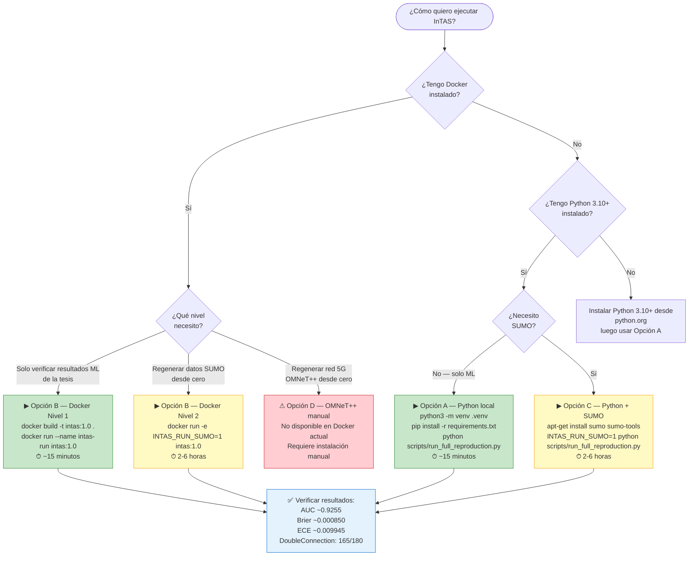

**Recomendación para revisores de tesis:** usar **Docker Nivel 1** (Opción B arriba). Un solo comando reproduce todos los resultados del capítulo de ML sin instalar nada más allá de Docker.

### 16.4 Reconstrucción Forzada

```bash
# Reconstruir desde cero (ignorar salidas existentes)
INTAS_FORCE_REBUILD=1 python scripts/run_full_reproduction.py

# Solo reconstruir ML (pasos 05 en adelante)
# Eliminar salidas del paso 05 y ejecutar en modo incremental
rm data/models/*.cbm data/models/*.joblib data/models/*.json
rm data/artifacts/ml/final/*.parquet
python scripts/run_full_reproduction.py
```

### 16.5 Estructura de Salidas

```
reports/
├── ml/
│   ├── report_catboost_isotonic.json  # Métricas discriminativas
│   ├── feature_importance.csv          # Importancia de features
│   └── ablation_auc.csv               # Ablación mínima
├── final/
│   ├── probabilistic_validity_global.csv  # Brier/ECE soft por variante
│   ├── rho_compare_recomputed_global.csv  # MAE/RMSE vs. rho analítica
│   ├── mmtqhu_validation_by_profile.csv   # Validación por perfil
│   └── thesis_figures/
│       ├── G1_roc_curves.pdf
│       ├── G2_calibration_diagram.pdf
│       ├── G3_rho_distribution_mmtqhu.pdf
│       ├── G4_rho_comparison_by_period.pdf
│       ├── G5_feature_importance.pdf
│       ├── G6_brier_ece_variants.pdf
│       ├── G7_injection_plan.pdf
│       └── figures_manifest.md
```

### 16.6 Troubleshooting General

| Síntoma | Causa probable | Solución |
|---------|---------------|----------|
| `[ERROR] EmptyDataError en kpis_omnet_raw.csv` | OMNeT++ no corrió pero FORCE_REBUILD=1 | Asegurarse de que seeds existen en `data/` antes de FORCE_REBUILD |
| `[ERROR] FCD bronze directory not found` | SUMO no corrió y seed dataset_windows.parquet falta | Restaurar `data/dataset_windows.parquet` desde git |
| `ModuleNotFoundError: catboost` | venv no activado | `source .venv/bin/activate` |
| `AUC < 0.85` tras re-entrenamiento | Dataset sin features de red | Verificar que `ml_table.parquet` tiene columnas `network_*` |
| `CatBoostError: Cannot load model` | Modelo entrenado con versión diferente | Reentrenar: `python scripts/05_train_ml_model.py` |

---

## 17. Manual de Usuario

### 17.1 Caso de Uso 1 — Revisor de Tesis

**Objetivo:** Verificar los resultados del Capítulo de Resultados sin instalar simuladores.

```bash
# Clonar y preparar entorno
git clone <repo-url>
cd InTAS_PRODUCCION_READY_ligero
python3 -m venv .venv && source .venv/bin/activate
pip install -r requirements.txt

# Ejecutar pipeline completo Nivel 1
python scripts/run_full_reproduction.py

# Verificar resultados clave
python -c "
import json, pandas as pd
# AUC
rep = json.load(open('reports/ml/report_catboost_isotonic.json'))
print('AUC CatBoost calibrado:', round(rep['roc_auc_cal'], 4))

# Brier/ECE
pb = pd.read_csv('reports/final/probabilistic_validity_global.csv')
row = pb[pb['variant'] == 'rho_cal_max'].iloc[0]
print('Brier soft (rho_cal_max):', round(row['brier_soft'], 6))
print('ECE soft   (rho_cal_max):', round(row['ece_soft'], 6))

# Inyección
plan = json.load(open('data/artifacts/ml/injection/injection_plan.json'))
print(f'DoubleConnection: {plan[\"n_learned\"]}/{plan[\"n_runs\"]} corridas')
"
```

**Valores esperados:**
- AUC: ~0.9255
- Brier soft: ~0.000850
- ECE soft: ~0.009945
- DoubleConnection: 165/180

### 17.2 Caso de Uso 2 — Investigador que Modifica Hiperparámetros

```bash
# Modificar hiperparámetros en el script directamente
# (o pasar por argumentos CLI)
python scripts/05_train_ml_model.py \
    --iterations 1500 \
    --depth 6 \
    --lr 0.04 \
    --seed 123

# El modelo se guarda en data/models/ y el reporte en reports/ml/
```

### 17.3 Caso de Uso 3 — Agregar un Nuevo Escenario SUMO

1. Crear `scenarios/sumo/hc4_15pct.sumocfg` con el nuevo escenario
2. Crear rutas `scenarios/sumo/routes/routes_HC4_15pct.rou.xml`
3. Añadir la entrada en `config/ml/experiment.yaml`:
   ```yaml
   periods: [HC1_5pct, ..., HC4_15pct]
   ```
4. Ejecutar desde paso 00A:
   ```bash
   INTAS_RUN_SUMO=1 INTAS_FORCE_REBUILD=1 python scripts/run_full_reproduction.py
   ```

### 17.4 Caso de Uso 4 — Inferencia sobre Nueva Corrida

```python
import pandas as pd
import joblib
from catboost import CatBoostClassifier

# Cargar modelos
model = CatBoostClassifier()
model.load_model("data/models/catboost_gbdt.cbm")
iso = joblib.load("data/models/isotonic.joblib")

# Preparar features de nueva corrida
# X_new debe tener las mismas columnas que ml_table.parquet
X_new = pd.read_parquet("data/nueva_corrida_ml_table.parquet")
features = [c for c in X_new.columns if c not in ["label", "run_id", "vehID", "t_ref"]]

# Inferencia
rho_raw = model.predict_proba(X_new[features])[:, 1]
rho_cal = iso.predict(rho_raw)

X_new["rho_hat_calibrado"] = rho_cal
print(X_new[["vehID", "t_ref", "rho_hat_calibrado"]].head())
```

---

## 18. Diagramas del Sistema

### 18.1 Diagrama de Flujo de Control del Orquestador

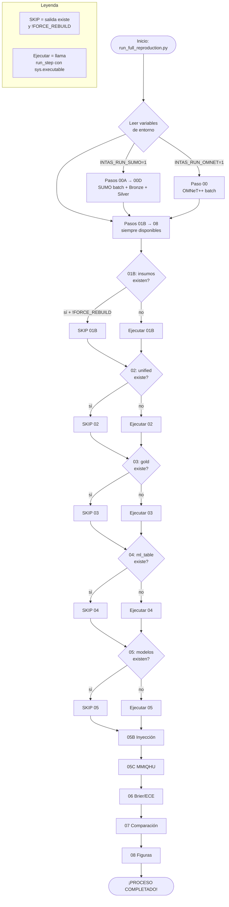

### 18.2 Diagrama de Componentes del Modelo ML

```mermaid
flowchart LR
    subgraph TRAIN["Entrenamiento (offline)"]
        direction TB
        ML[ml_table.parquet\n42503 × 43 cols]
        GSS[GroupShuffleSplit\nby run_id\n80% train / 20% test]
        CB_TRAIN[CatBoost.fit\ntrain set]
        ISO_TRAIN[IsotonicRegression.fit\np_raw_test vs y_test]
        XGB_TRAIN[XGBoost.fit\ntrain set + LabelEncoder]

        ML --> GSS
        GSS -->|X_train, y_train| CB_TRAIN
        CB_TRAIN -->|p_raw_test| ISO_TRAIN
        GSS -->|X_train, y_train| XGB_TRAIN
    end

    subgraph ARTIFACTS["Artefactos guardados"]
        CBM[catboost_gbdt.cbm]
        JOBLIB[isotonic.joblib]
        XJSON[xgboost_ref.json]
        ENC[xgb_encoders.joblib]
    end

    subgraph INFERENCE["Inferencia (online)"]
        X_NEW[Nueva ventana\ncinemáticas + red + categóricas]
        CB_INF[CatBoost.predict_proba]
        ISO_INF[IsotonicRegression.predict]
        RHO[ρ̂_calibrado\n∈ [0,1]]

        X_NEW --> CB_INF --> ISO_INF --> RHO
    end

    CB_TRAIN --> CBM
    ISO_TRAIN --> JOBLIB
    XGB_TRAIN --> XJSON & ENC
    CBM --> CB_INF
    JOBLIB --> ISO_INF
```

### 18.3 Diagrama de Estados — Vehículo en el Sistema

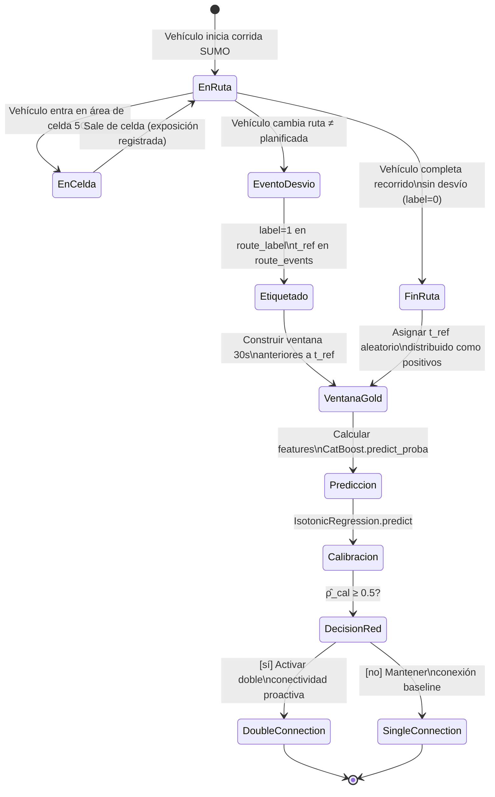

### 18.4 Diagrama de Despliegue Físico

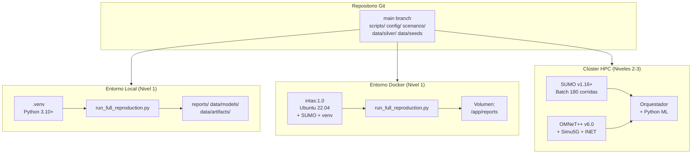

---

## 19. Buenas Prácticas Aplicadas

### 19.1 Ingeniería de Software

| Práctica | Implementación en InTAS |
|----------|------------------------|
| **Principio de responsabilidad única** | Cada script realiza exactamente una transformación del pipeline |
| **Idempotencia** | `should_skip()` en el orquestador verifica salidas existentes antes de ejecutar |
| **Fail fast** | `raise SystemExit(...)` en errores críticos; `result.returncode != 0 → sys.exit(1)` |
| **Manejo graceful de ausencias** | Fallbacks documentados en 01B, 02, 03 para modo Ligero |
| **Reproducibilidad por diseño** | Seeds fijadas en todos los puntos de aleatoriedad |

### 19.2 Machine Learning Engineering (MLOps)

| Práctica | Implementación en InTAS |
|----------|------------------------|
| **Prevención de data leakage** | `GroupShuffleSplit` por `run_id` completo |
| **Calibración de probabilidades** | Isotonic Regression aplicada post-entrenamiento |
| **Ablación de features** | Entrenamiento sin features de red para comparación |
| **Contraste de modelos** | XGBoost como modelo de referencia independiente |
| **Métricas apropiadas al dominio** | Brier Score y ECE *soft* vs. referencia analítica continua |
| **Versionado de modelos** | Formatos nativos (`.cbm`, `.json`) + metadata en JSON |

### 19.3 Gestión de Datos

| Práctica | Implementación en InTAS |
|----------|------------------------|
| **Arquitectura Bronze-Silver-Gold** | 3 capas de procesamiento con trazabilidad completa |
| **Formato columnar** | Apache Parquet con compresión; lectura parcial por columna |
| **Seeds como artefactos versionados** | Pre-generados y commitados en Git para reproducibilidad |
| **Manifests de integridad** | SHA-256 por artefacto en `artifacts_manifest.json` |
| **Tipado explícito** | `cell_id.astype("string")`, `label.astype(int)` en todos los scripts |

### 19.4 Documentación

| Práctica | Implementación en InTAS |
|----------|------------------------|
| **README como puerta de entrada** | Guía rápida en < 5 minutos para Nivel 1 |
| **Docstrings de módulo** | Cada script tiene cabecera con propósito, entradas y salidas |
| **Valores esperados documentados** | Sección de validación con rangos numéricos verificados |
| **Diagramas Mermaid** | Reproducibles en GitHub/GitLab/Obsidian/VSCode sin herramientas externas |

---

## 20. Glosario de Términos

| Término | Definición |
|---------|-----------|
| **AUC ROC** | Área Bajo la Curva ROC. Mide la capacidad discriminativa de un clasificador binario entre [0,1], donde 0.5 es aleatorio y 1.0 es perfecto. |
| **Brier Score** | Error cuadrático medio entre probabilidades predichas y etiquetas reales. 0 = perfecto, 1 = peor posible. En InTAS se usa en versión *soft* vs. ρ analítica. |
| **Bronze** | Capa de datos crudos tal como salen del simulador (XML, .sca, .vec). Inmutable. |
| **CatBoost** | Gradient Boosting Decision Tree de Yandex. Maneja columnas categóricas nativas sin encoding manual. |
| **CDR** | Call Drop Rate. Fracción de conexiones 5G caídas durante la simulación. |
| **cell_id** | Identificador de celda 5G. En InTAS hay 10 celdas definidas sobre la red vial de Ingolstadt. |
| **CPSS** | Cyber-Physical-Social System. Sistema que integra mundo físico, redes de cómputo/comunicación y comportamiento humano. |
| **DoubleConnection-CBR-DL** | Configuración OMNeT++/Simu5G de doble conectividad (eNB + gNB simultáneos) en downlink. Activada cuando ρ̂ ≥ 0.5. |
| **ECE** | Expected Calibration Error. Mide cuánto se desvía la confianza del modelo de la frecuencia real de aciertos, por bins de probabilidad. |
| **eNB** | Evolved NodeB. Estación base LTE (4G) en la red heterogénea. |
| **FCD** | Floating Car Data. Salida de SUMO con posición, velocidad y aceleración de cada vehículo por timestep. |
| **gNB** | Next-Generation NodeB. Estación base 5G NR. |
| **Gold** | Capa de datos lista para ML: features de ventana temporal, join con métricas de red, etiquetas binarias. |
| **GroupShuffleSplit** | Partición train/test que garantiza que todos los ejemplos de un grupo (run_id) están en un solo conjunto. Previene data leakage. |
| **Handover** | Transferencia de la conexión de un vehículo de una celda 5G a otra. Los tardíos causan pérdida de paquetes. |
| **HC1/HC2/HC3** | Períodos de congestión de tráfico (High Congestion 1, 2, 3). Representan distintos horarios del día. |
| **INET** | Framework de modelos de red para OMNeT++. Provee protocolos TCP/IP, movilidad, etc. |
| **InTAS** | Ingolstadt Traffic and Automotive Simulation. Nombre del proyecto/escenario. |
| **Isotonic Regression** | Función de calibración monotónica no-decreciente. Mapea scores crudos del modelo a probabilidades verdaderas. |
| **Jerk** | Derivada de la aceleración respecto al tiempo. Indica cambios bruscos de aceleración (posible indicador de desvío). |
| **LabelEncoder** | Componente de scikit-learn que convierte strings categóricos a enteros para XGBoost. |
| **MMtQHU** | Esquema de segmentación comportamental. Propietario (sin VFH_) vs. Empleado (con VFH_). |
| **OMNeT++** | Discrete-event simulator para redes. En InTAS usa Simu5G para simular redes 5G NR. |
| **PEP 668** | Estándar Python que prohíbe pip install en el intérprete del sistema en sistemas operativos modernos. Requiere uso de venv. |
| **Política ceiling** | Política de enrutamiento que fuerza conexión con la celda "techo" (gNB más cercano). En InTAS corresponde a DoubleConnection. |
| **Política nearest** | Política de enrutamiento que conecta al nodo de red más cercano. Baseline en InTAS. |
| **PRB** | Physical Resource Block. Unidad de asignación de recursos radioeléctricos en LTE/5G NR. |
| **QoS** | Quality of Service. Métricas de calidad de servicio de red: latencia, throughput, pérdida de paquetes. |
| **ρ (rho analítica)** | Probabilidad de desvío de ruta calculada determinísticamente a partir de la configuración del escenario. Es la referencia de verdad de campo. |
| **ρ̂ (rho aprendida)** | Probabilidad de desvío estimada por el modelo ML. Puede ser raw (sin calibrar) o calibrada. |
| **run_id** | Identificador único de una corrida de simulación. Formato: `{período}__{política}__{rep}`. |
| **SHA-256** | Función hash criptográfica usada para verificar integridad de artefactos. |
| **Silver** | Capa de datos limpios y estandarizados en formato Parquet. Derivada del Bronze. |
| **Simu5G** | Framework sobre INET para simulación de redes 5G NR y LTE en OMNeT++. |
| **SINR** | Signal-to-Interference-plus-Noise Ratio. Relación señal a ruido en dB. KPI central de calidad de enlace 5G. |
| **SUMO** | Simulation of Urban MObility. Simulador de tráfico vehicular microscópico de código abierto. |
| **sys.executable** | Ruta del intérprete Python activo. Usada en el orquestador para que subprocesos hereden el venv. |
| **TraceFileMobility** | Módulo INET que reproduce trayectorias predefinidas en OMNeT++, eliminando variabilidad de movilidad estocástica. |
| **UE** | User Equipment. Dispositivo del usuario en la red 5G. En InTAS, cada vehículo es un UE. |
| **vehID** | Identificador de vehículo en SUMO. Sin prefijo VFH_ = propietario; con VFH_ = empleado. |
| **venv** | Entorno virtual de Python. Aísla dependencias del proyecto del intérprete del sistema. |
| **XGBoost** | eXtreme Gradient Boosting. Implementación eficiente de GBDT. Usado como modelo de contraste en InTAS. |

---

## 21. Bibliografía y Referencias

### 21.1 Herramientas y Frameworks

1. **SUMO — Simulation of Urban MObility.**  
   Eclipse Foundation. Versión 1.16+. URL: https://sumo.dlr.de  
   Krajzewicz, D., et al. (2012). *Recent development and applications of SUMO - Simulation of Urban MObility*. International Journal On Advances in Systems and Measurements, 5(3-4).

2. **OMNeT++ Discrete Event Simulator.**  
   Varga, A. (2010). *OMNeT++*. In Modeling and Tools for Network Simulation (pp. 35-59). Springer. Versión 6.0. URL: https://omnetpp.org

3. **Simu5G — 5G NR Simulation Framework.**  
   Nardini, G., et al. (2020). *Simu5G–A System-Level Simulator for 5G Networks*. IEEE Access, 8, 181176-181191. Versión 1.3.

4. **INET Framework.**  
   OpenSim Ltd. Versión 4.4. URL: https://inet.omnetpp.org

### 21.2 Aprendizaje Automático

5. **CatBoost.**  
   Prokhorenkova, L., et al. (2018). *CatBoost: Unbiased Boosting with Categorical Features*. Advances in Neural Information Processing Systems 31. Versión 1.2.7.

6. **XGBoost.**  
   Chen, T., & Guestrin, C. (2016). *XGBoost: A Scalable Tree Boosting System*. ACM SIGKDD International Conference on Knowledge Discovery and Data Mining. Versión 2.0.3.

7. **scikit-learn.**  
   Pedregosa, F., et al. (2011). *Scikit-learn: Machine Learning in Python*. JMLR, 12, 2825-2830. Versión 1.6.1.

8. **Isotonic Calibration.**  
   Niculescu-Mizil, A., & Caruana, R. (2005). *Predicting Good Probabilities with Supervised Learning*. ICML 2005.

9. **GroupShuffleSplit / Data Leakage.**  
   Kaufman, S., et al. (2012). *Leakage in Data Mining: Formulation, Detection, and Avoidance*. TKDD, 6(4).

### 21.3 Redes 5G y Sistemas Vehiculares

10. **3GPP TS 36.300 — E-UTRA and E-UTRAN Overall Description.**  
    3rd Generation Partnership Project. Dual Connectivity, Release 15+.

11. **3GPP TS 38.300 — NR; NR and NG-RAN Overall Description.**  
    3rd Generation Partnership Project. Release 15+.

12. **Vehicular Networks and 5G.**  
    Araniti, G., et al. (2013). *LTE for Vehicular Networking: A Survey*. IEEE Communications Magazine, 51(5), 148-157.

### 21.4 Arquitectura de Datos y MLOps

13. **The Data Lakehouse Architecture.**  
    Armbrust, M., et al. (2021). *Lakehouse: A New Generation of Open Platforms that Unify Data Warehousing and Advanced Analytics*. CIDR 2021.

14. **Apache Parquet.**  
    Apache Software Foundation. Columnar storage format. URL: https://parquet.apache.org

15. **Calibration of Machine Learning Models.**  
    Guo, C., et al. (2017). *On Calibration of Modern Neural Networks*. ICML 2017.

### 21.5 Estándares de Documentación

16. **IEEE Std 1016-2009.**  
    IEEE Standard for Information Technology — Systems Design — Software Design Descriptions. IEEE, 2009.

17. **ISO/IEC 25010:2011.**  
    Systems and Software Engineering — Systems and Software Quality Requirements and Evaluation (SQuaRE). ISO/IEC, 2011.

---

*Documentación elaborada por **Jose David Arias Pantoja** como parte del trabajo de grado de Pregrado en la Universidad Cooperativa de Colombia, bajo la dirección del **Ing. Nestor Alzate Mejia**. Todos los valores numéricos han sido extraídos directamente de artefactos verificados del pipeline. Última actualización: 2026-05-12.*

*Para reportar discrepancias entre esta documentación y el código, referir al archivo `scripts/run_full_reproduction.py` como fuente de verdad del pipeline.*
